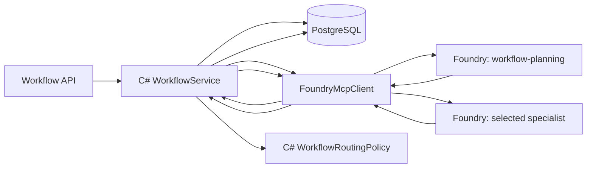

# Agent implementation and Foundry runtime

This document traces the current agent code from the C# orchestrator through the
Python LangGraph runtime and Microsoft Foundry deployment. It distinguishes what the
repository implements today from the Agent Framework and MCP target architecture.

## Current architecture in one sentence

The C# `WorkflowService` now runs a small Agent Framework workflow that sequences
planner, routing, and specialist execution before it persists workflow state in
PostgreSQL; the Python agents still do not call each other or access PostgreSQL.
The transport boundary is a Foundry-backed MCP-style adapter that now performs a
pre-invocation tool discovery step for each agent before sending the hosted-agent
request, allowing the runtime to use discovered tool catalogs and endpoint metadata
when available.



Despite the C# type name `FoundryMcpClient`, the production boundary is the Foundry
hosted-agent invocation protocol, not MCP. Agent Framework does not currently drive
the orchestration loop. Those migrations are tracked in GitHub issues
[#17](https://github.com/briandenicola/banking-agent-foundry-orchestrator/issues/17)
and
[#18](https://github.com/briandenicola/banking-agent-foundry-orchestrator/issues/18).

## Source map

| Concern | Source |
| --- | --- |
| LangGraph state and topology | [`base.py`](../src/agents/python/app/agents/base.py#L11-L25) |
| Planner instructions | [`planning.py`](../src/agents/python/app/agents/planning.py#L4-L12) |
| Transaction instructions | [`transaction_explanation.py`](../src/agents/python/app/agents/transaction_explanation.py#L4-L11) |
| Suspicious-activity instructions | [`suspicious_activity.py`](../src/agents/python/app/agents/suspicious_activity.py#L4-L11) |
| Dispute instructions | [`dispute.py`](../src/agents/python/app/agents/dispute.py#L4-L11) |
| Agent registry | [`registry.py`](../src/agents/python/app/agents/registry.py#L9-L18) |
| Request/result schemas | [`contracts.py`](../src/agents/python/app/contracts.py#L9-L40) |
| Model and deterministic fallback | [`model.py`](../src/agents/python/app/model.py#L15-L143) |
| Foundry hosted entrypoint | [`hosted.py`](../src/agents/python/app/hosted.py#L20-L67) |
| Shared hosted image | [`Dockerfile.hosted`](../src/agents/python/Dockerfile.hosted) |
| Agent Framework workflow orchestration | [`AgentFrameworkWorkflowOrchestrator`](../src/application/AgentFrameworkWorkflowOrchestrator.cs) |
| C# planner/specialist sequence | [`WorkflowService.ExecuteRoutingAsync`](../src/application/WorkflowService.cs) |
| C# hosted-agent telemetry | [`WorkflowService.InvokeAgentAsync`](../src/application/WorkflowService.cs) |
| C# result validation | [`WorkflowService.TryReadAgentResult`](../src/application/WorkflowService.cs) |
| Foundry MCP discovery and invocation | [`FoundryMcpClient.DiscoverToolsAsync`](../src/infrastructure/FoundryMcpClient.cs) and [`FoundryMcpClient.InvokeAsync`](../src/infrastructure/FoundryMcpClient.cs) |
| Tool-to-agent endpoint map | [`apps/main.tf`](../apps/main.tf#L27-L32) |
| Hosted-agent definitions | [`apps/main.tf`](../apps/main.tf#L34-L55) |
| Deployer Container Apps Job | [`apps/agent-deployer.tf`](../apps/agent-deployer.tf) |
| Foundry registration client | [`deploy.py`](../src/agents/deployer/deploy.py#L28-L289) |
| Foundry and ACR roles | [`apps/roles.tf`](../apps/roles.tf#L19-L54) |
| Post-deploy instance access | [`deploy-hosted-agents.sh`](../scripts/deploy-hosted-agents.sh#L9-L116) |

## 1. LangGraph code

### Shared state

All four agents use the same two-field LangGraph state declared in
[`AgentState`](../src/agents/python/app/agents/base.py#L11-L14):

```python
class AgentState(TypedDict):
    request: AgentRequest
    result: AgentResult | None
```

`request` is immutable input for one invocation. The sole graph node writes `result`.
There is no checkpointer, thread ID, persistence adapter, message history, or
cross-agent state in the Python graph.

### Graph topology

[`build_agent_graph`](../src/agents/python/app/agents/base.py#L16-L25) builds and
compiles this graph for every agent:

```text
START -> analyze -> END
```

The `analyze` node calls:

```python
result = await reason(agent, instructions, state["request"])
```

and returns `{"result": result}`. Therefore the present LangGraph usage is a
single-node structured reasoning wrapper. Workflow sequencing, routing, approval,
durability, and recovery are not LangGraph nodes; they are C# application logic.

### Four compiled graphs

Each module calls the shared builder with a different `AgentName` and system
instruction:

| Agent | Code | Responsibility encoded in its prompt |
| --- | --- | --- |
| `workflow-planning` | [`planning.py`](../src/agents/python/app/agents/planning.py#L4-L12) | Classify intent, recommend one specialist, assess risk, and recommend whether approval is needed; never act. |
| `transaction-explanation` | [`transaction_explanation.py`](../src/agents/python/app/agents/transaction_explanation.py#L4-L11) | Explain transaction status using supplied context without inventing account or merchant data. |
| `suspicious-activity` | [`suspicious_activity.py`](../src/agents/python/app/agents/suspicious_activity.py#L4-L11) | Separate observed facts from hypotheses and recommend protective next steps; flag modifying actions for approval. |
| `dispute-planning` | [`dispute.py`](../src/agents/python/app/agents/dispute.py#L4-L11) | Prepare a bounded dispute plan and identify missing information/evidence; never submit a dispute. |

[`registry.py`](../src/agents/python/app/agents/registry.py#L9-L18) imports those four
already-compiled graphs and maps the `AgentName` enum to the correct graph. There is
no dynamic graph discovery.

### Typed invocation contract

[`contracts.py`](../src/agents/python/app/contracts.py#L9-L40) defines the Pydantic
boundary:

- `AgentName` limits identity to the four registered names.
- `contract_version` identifies the `"1.0"` request/result boundary.
- `AgentRequest.message` is required and nonempty.
- `trace_id`, `workflow_id`, `input`, `metadata`, and `context` carry invocation
  metadata.
- Top-level `context` is authoritative; legacy `input.context` is promoted when the
  top-level value is absent.
- `AgentResult` requires agent identity, status, trace ID, intent, summary, risk,
  approval recommendation, recommended action, and next step.
- `execution_mode` reports whether the result came from the live model or the
  deterministic fallback.
- The planner can set `selected_agent`.
- `evidence` is a list of reasoning strings, not uploaded evidence files.

`AgentRequest` allows extra fields so the Foundry envelope can evolve without
immediately failing Pydantic validation. The C# side is stricter about the subset it
accepts from `AgentResult`; see
[`TryReadAgentResult`](../src/application/WorkflowService.cs#L767-L824).

### Model call

[`model._model`](../src/agents/python/app/model.py#L15-L45) chooses one of three
paths:

1. If `BANKING_AGENT_PROJECT_ENDPOINT` exists, create `ChatOpenAI` against the project's
   `/openai/v1/` endpoint and acquire an Entra token for
   `https://ai.azure.com/.default`. The deployer job populates this value with the
   non-reserved `BANKING_AGENT_PROJECT_ENDPOINT` name; the runtime also accepts the
   legacy `FOUNDRY_PROJECT_ENDPOINT` name for compatibility.
2. Otherwise, if `AZURE_OPENAI_ENDPOINT` exists, create `AzureChatOpenAI` and acquire
   an Entra token for `https://cognitiveservices.azure.com/.default`.
3. Otherwise, report that no model is configured.

[`reason`](../src/agents/python/app/model.py#L47-L70) wraps the model with
`with_structured_output(AgentResult)`, sends the agent-specific instructions as the
system message, and sends trace ID, customer request, and the normalized specialist
context as the user message. It then overwrites `agent`, `status`, `trace_id`,
`contract_version`, and `execution_mode` so those operational fields come from the
runtime rather than the model.

If no model is configured and `ALLOW_FALLBACK` is explicitly set to an affirmative
value for local development,
[`_local_result`](../src/agents/python/app/model.py#L73-L143) returns deterministic
rule-based results for every agent. This makes local tests and demonstrations
repeatable and marks every result with `execution_mode: fallback`. Hosted production
registrations set `ALLOW_FALLBACK=false`, so missing model configuration fails the
invocation rather than returning a success-shaped fallback.

### Versioned planner-to-specialist context handoff

The C# service builds planner handoff fields under `context` in
[`WorkflowService`](../src/application/WorkflowService.cs):

```text
parameters["context"]["planner_summary"]
parameters["context"]["planner_evidence"]
parameters["context"]["planner_selected_agent"]
parameters["context"]["selected_agent"]
```

[`FoundryMcpClient`](../src/infrastructure/FoundryMcpClient.cs) emits the versioned
`1.0` envelope with `context` both at the typed top level and within the retained
`input` dictionary. [`AgentRequest`](../src/agents/python/app/contracts.py) treats the
top-level value as authoritative and promotes legacy `input.context` when required.
[`reason`](../src/agents/python/app/model.py) sends that normalized value to the
selected specialist model. A shared JSON fixture exercises the exact C# serialization
and Python Pydantic boundary.

This handoff is orchestrator-mediated context passing, not direct agent-to-agent
communication. The subsequent real MCP contract and discovery work remains tracked in
[#18](https://github.com/briandenicola/banking-agent-foundry-orchestrator/issues/18).

## 2. Foundry hosted runtime

### Process startup

[`Dockerfile.hosted`](../src/agents/python/Dockerfile.hosted) installs the Python
requirements, copies `app/`, switches to non-root user `1000`, and runs:

```text
python -m app.hosted
```

At module import,
[`hosted.py`](../src/agents/python/app/hosted.py#L20-L22):

1. reads `BANKING_AGENT_KIND`;
2. converts it to the `AgentName` enum;
3. selects one compiled graph from the registry; and
4. constructs `InvocationAgentServerHost`.

This is how one image becomes four separately addressable agents: Foundry starts
separate hosted-agent registrations from the same image with a different
`BANKING_AGENT_KIND`.

### Request handling

[`handle_invoke`](../src/agents/python/app/hosted.py#L25-L64):

1. reads the Foundry HTTP request body;
2. validates it as `AgentRequest`;
3. invokes the selected graph with
   `{"request": payload, "result": None}`;
4. enforces `AGENT_INVOKE_TIMEOUT_SECONDS` (30 seconds by default);
5. serializes the resulting `AgentResult`; and
6. returns JSON.

Boundary behavior is explicit:

| Condition | Response |
| --- | --- |
| Invalid JSON or `AgentRequest` | HTTP 400, `invalid_request` |
| Graph exceeds timeout | HTTP 504, `timeout` |
| Graph/model raises | HTTP 500, safe `agent_error` |
| Valid result | HTTP 200 with the `AgentResult` JSON body |

The real ASGI boundary is exercised in
[`test_hosted.py`](../src/agents/python/tests/test_hosted.py); graph routing and
fallback behavior are exercised in
[`test_agents.py`](../src/agents/python/tests/test_agents.py).

## 3. How the C# orchestrator coordinates agents

### Planner call

[`ExecuteRoutingAsync`](../src/application/WorkflowService.cs#L189-L355) begins with
the persisted workflow and creates planner parameters containing:

- customer message;
- durable workflow ID;
- durable trace ID;
- `planning` status; and
- the current correlation ID when available.

It calls `InvokeAgentAsync("workflow.plan", "workflow-planning", ...)`. The tool name
is resolved to the planner's Foundry endpoint through the Terraform-generated map.
The response becomes a durable `workflow.plan` event only after
`TryReadAgentResult` verifies the response.

### Routing authority

The planner's `selected_agent` and `requires_approval` are recommendations. The C#
[`WorkflowRoutingPolicy`](../src/application/WorkflowRoutingPolicy.cs) independently
chooses the specialist and approval requirement. If planner and policy disagree,
`WorkflowService` logs the difference and uses the C# policy. This prevents a model
response from bypassing deterministic approval controls.

### Specialist call

The selected C# route maps to one tool:

| C# route | Tool | Foundry registration |
| --- | --- | --- |
| `transaction-explanation` | `transaction.explain` | `transaction-explanation` |
| `suspicious-activity` | `suspicious.assess` | `suspicious-activity` |
| `dispute-planning` | `dispute.plan` | `dispute-planning` |

The tool map is defined twice for separate purposes:

- `WorkflowService.SpecialistTools` selects the tool name.
- [`foundry_tool_endpoints`](../apps/main.tf#L27-L32) maps that tool name to a
  concrete Foundry hosted-agent URL.

After validating the specialist result, the C# service—not the Python agent—sets
`Completed` or `WaitingForApproval` and persists the terminal event in PostgreSQL.
Python's `requires_approval` is not authoritative.

### Transport and authentication

[`FoundryMcpClient.InvokeAsync`](../src/infrastructure/FoundryMcpClient.cs#L54-L199):

1. resolves the tool name to its configured endpoint;
2. builds the Foundry invocation JSON envelope;
3. obtains a managed-identity token for `https://ai.azure.com/.default`;
4. sends `POST` with bearer authentication;
5. forwards `x-correlation-id` when present;
6. retries configured transient failures; and
7. returns the HTTP body in `McpToolResult.Data["response_body"]`.

The orchestrator registers this implementation through
[`AddHttpClient<IMcpClient, FoundryMcpClient>`](../src/orchestrator/Program.cs#L137-L153).
The `IMcpClient` name is an abstraction inherited from the target design; no MCP wire
messages are sent today.

### Result validation

[`TryReadAgentResult`](../src/application/WorkflowService.cs#L767-L824) rejects a
response unless:

- transport status is `ok`;
- `response_body` exists;
- JSON deserializes;
- result status is `ok`;
- intent and summary are nonempty; and
- returned agent identity exactly matches the expected registration.

This stops a response from one hosted agent being accepted as another. The accepted
specialist intent and summary become durable workflow data; the C# route controls
approval.

## 4. How the agents are built and deployed to Foundry

### Step 1: Build the shared image

[`task app:build-hosted-agents`](../tasks/Taskfile.app.yml#L68-L81) runs an ACR build
for `Dockerfile.hosted` and publishes:

```text
hosted-agents:<eight-character-commit>
hosted-agents:latest
```

Terraform uses the immutable `image_tag` in
[`hosted_agents_image`](../apps/main.tf#L16). The same immutable image is supplied to
all four registrations.

### Step 2: Terraform configures the deployer job

[`apps/main.tf`](../apps/main.tf#L34-L55) declares four `{name, kind}` objects.
[`apps/agent-deployer.tf`](../apps/agent-deployer.tf) creates a manually triggered
Azure Container Apps Job and injects:

| Environment variable | Source and purpose |
| --- | --- |
| `AZURE_CLIENT_ID` | Agent-deployer managed identity |
| `FOUNDRY_PROJECT_ENDPOINT` | Foundry project data-plane endpoint |
| `HOSTED_AGENT_IMAGE` | Immutable ACR image |
| `AZURE_AI_MODEL_DEPLOYMENT_NAME` | Model deployment name |
| `AGENT_DEFINITIONS` | JSON array of the four registrations |

Terraform also guarantees the job is created after the required ACR and Foundry role
assignments.

### Step 3: The job registers versions in Foundry

[`deploy.py`](../src/agents/deployer/deploy.py#L28-L289) uses
`ManagedIdentityCredential` and the `https://ai.azure.com/.default` scope. For each
definition it:

1. queries the existing agent and versions;
2. skips an active version when image, kind, and model already match;
3. otherwise creates the agent or posts a new version;
4. registers `kind: hosted`, 0.5 CPU, 1 GiB memory, and invocation protocol `2.0.0`;
5. sets `BANKING_AGENT_KIND` and `AZURE_AI_MODEL_DEPLOYMENT_NAME`; and
6. waits until the version is `active` or `running`.

The registration does not create four images. It creates four Foundry agent identities
and versions that all point to the same image but start it with different graph
selection.

### Step 4: Foundry pulls and starts the image

[`apps/roles.tf`](../apps/roles.tf#L40-L54) grants:

- the Foundry project identity `AcrPull` on the registry; and
- the Foundry project identity `Foundry User` on the Foundry account.

Foundry can then pull the shared image, start the `app.hosted` process, and route
invocation-protocol requests to it.

### Step 5: Grant each running agent model access

The hosted-agent instance identity does not exist until Foundry creates a version.
Therefore Terraform cannot assign its model role in advance.

[`scripts/deploy-hosted-agents.sh`](../scripts/deploy-hosted-agents.sh#L9-L116)
starts the Container Apps Job, waits for success, lists each active Foundry version,
extracts its `instance_identity.principal_id`, and idempotently grants
`Cognitive Services OpenAI User` on the Foundry account.

This post-deploy role assignment is an intentional lifecycle exception that is driven
by a repository script because the principal IDs are generated by Foundry at runtime.
The desired roles and deployment mechanism remain represented by Terraform and the
versioned script.

### Step 6: The orchestrator calls the registered endpoints

Terraform builds these URLs in
[`foundry_tool_endpoints`](../apps/main.tf#L27-L32):

```text
.../agents/workflow-planning/endpoint/protocols/invocations?api-version=v1
.../agents/transaction-explanation/endpoint/protocols/invocations?api-version=v1
.../agents/suspicious-activity/endpoint/protocols/invocations?api-version=v1
.../agents/dispute-planning/endpoint/protocols/invocations?api-version=v1
```

[`apps/orchestrator.tf`](../apps/orchestrator.tf#L115-L139) injects that JSON map and
retry configuration into the orchestrator. The orchestrator identity receives
`Foundry Agent Consumer` in
[`apps/roles.tf`](../apps/roles.tf#L19-L25).

## 5. Runtime model enforcement

[`deploy.py`](../src/agents/deployer/deploy.py) registers every hosted agent with
`BANKING_AGENT_KIND`, `AZURE_AI_MODEL_DEPLOYMENT_NAME`,
`FOUNDRY_PROJECT_ENDPOINT`, and `ALLOW_FALLBACK=false`. All four values participate
in version matching, so changing runtime behavior creates a new hosted-agent version.

Every result carries `contract_version` and `execution_mode`. The orchestrator records
those non-PII fields in workflow event details and OpenTelemetry tags. Production smoke
checks require both planner and specialist events to report `execution_mode: model`;
missing evidence or any fallback result fails the smoke run.

## 6. What is durable and what is not

| State | Owner | Durable? |
| --- | --- | --- |
| Workflow status, version, route, intent | C# orchestrator + PostgreSQL | Yes |
| Workflow events and audit trail | C# orchestrator + PostgreSQL | Yes |
| Evidence files and metadata | C# orchestrator + PostgreSQL | Yes |
| Approval, action execution, support case | C# orchestrator + PostgreSQL | Yes |
| Python `AgentState` during one invocation | Foundry-hosted process | No |
| Planner model context | Planner request only | No |
| Specialist model context | Specialist request only | No |
| Cross-agent memory | Not implemented | No |
| LangGraph checkpoint/thread | Not configured | No |

For the proposed Agent Framework, MCP, shared-artifact, outbox, and Agent Host
Protocol evolution, see
[Recommended shared-state evolution](mvp-implementation-operations-guide.md#recommended-shared-state-evolution).
