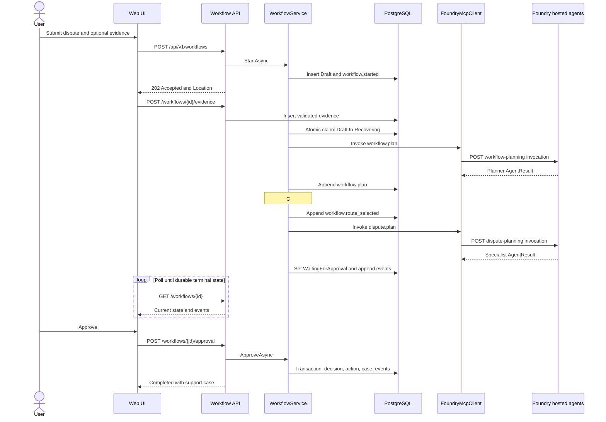
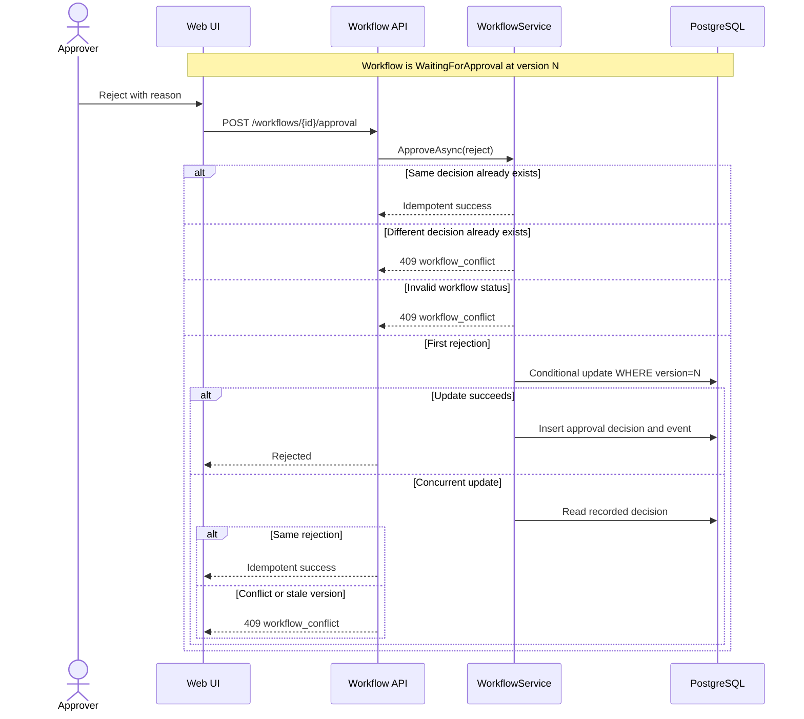
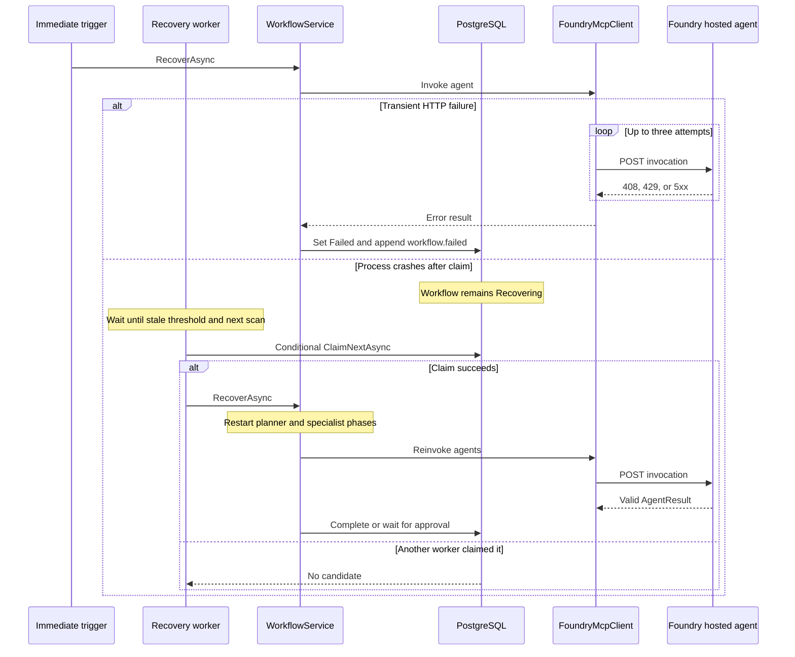

# MVP implementation and operations guide

This guide is the source of truth for developers implementing the banking-agent MVP
and operators deploying or supporting it. It describes the current repository, not
the target architecture in isolation. Commands are run from the repository root
unless noted otherwise.

## 1. System overview

The MVP is an asynchronous, database-driven workflow:

1. The ASP.NET Core Web UI submits a request to the versioned workflow API.
2. The C# orchestrator persists a `Draft` workflow and returns `202 Accepted`.
3. A best-effort trigger or the durable recovery worker atomically claims the work.
4. The orchestrator invokes a planning agent hosted in Microsoft Foundry.
5. Deterministic C# policy selects a specialist agent and whether approval is needed.
6. The selected Foundry-hosted LangGraph agent returns a recommendation.
7. PostgreSQL stores every workflow transition and audit event.
8. Sensitive requests pause in `WaitingForApproval`; approval or rejection is
   recorded transactionally.
9. The Web UI polls the durable workflow resource until it reaches a polling-terminal
   state.

PostgreSQL is the system of record. Hosted agents are stateless request/response
workers: they do not query PostgreSQL, call one another, or own workflow transitions.

### Runtime components

| Component | Responsibility | Code |
| --- | --- | --- |
| Web UI | Submit, upload evidence, poll, approve, render results | [`src/webui`](../src/webui) |
| Workflow API | Validate HTTP contracts and map failures to ProblemDetails | [`WorkflowEndpoints.cs`](../src/api/WorkflowEndpoints.cs), [`ApiProblemDetails.cs`](../src/api/ApiProblemDetails.cs) |
| Application orchestrator | Plan, route, invoke, transition, approve, and fail workflows | [`WorkflowService.cs`](../src/application/WorkflowService.cs) |
| Routing policy | Make the authoritative specialist and approval decision | [`WorkflowRoutingPolicy.cs`](../src/application/WorkflowRoutingPolicy.cs) |
| Foundry boundary | Authenticate and invoke statically configured hosted-agent endpoints | [`FoundryMcpClient.cs`](../src/infrastructure/FoundryMcpClient.cs) |
| Persistence | Store workflow state and enforce concurrency/idempotency | [`src/infrastructure/Persistence`](../src/infrastructure/Persistence) |
| Recovery | Claim new or stale work after process/revision failure | [`WorkflowExecutionTrigger.cs`](../src/orchestrator/WorkflowExecutionTrigger.cs), [`WorkflowRecoveryWorker.cs`](../src/orchestrator/WorkflowRecoveryWorker.cs) |
| Hosted agents | Run one-step LangGraph analysis using the configured model | [`src/agents/python/app`](../src/agents/python/app) |
| Agent deployer | Create or version Foundry hosted agents | [`deploy.py`](../src/agents/deployer/deploy.py) |
| Database migrator | Apply EF migrations and grant runtime privileges | [`src/database-migrator/Program.cs`](../src/database-migrator/Program.cs) |

The C# solution follows Domain -> Application -> Infrastructure/API -> Host. Domain
code has no HTTP, EF Core, or Azure dependencies.

## 2. Workflow lifecycle

### Creation and execution

`POST /api/v1/workflows` calls `WorkflowService.StartAsync`, which persists the
workflow and `workflow.started` event before returning. The API response contains the
workflow ID, trace ID, initial `Draft` status, and a `Location` header for
`GET /api/v1/workflows/{id}`.

The API then calls `IWorkflowExecutionTrigger.Trigger(id)`. The implementation in
[`WorkflowExecutionTrigger.cs`](../src/orchestrator/WorkflowExecutionTrigger.cs)
creates a service scope and asks the repository to claim that exact `Draft`. This is
only a latency optimization. If the process exits before or during execution,
[`WorkflowRecoveryWorker.cs`](../src/orchestrator/WorkflowRecoveryWorker.cs) scans
PostgreSQL and resumes eligible work.

| Status | Meaning | Polling behavior |
| --- | --- | --- |
| `Draft` | Persisted but not yet claimed | Continue |
| `Recovering` | Claimed and executing planner/specialist phases | Continue |
| `WaitingForApproval` | Sensitive recommendation is durably paused | Stop and request a decision |
| `Completed` | Informational result or approved action completed | Stop |
| `Rejected` | Approver rejected the recommendation | Stop |
| `Failed` | Planner, specialist, validation, timeout, or cancellation failed | Stop |

The Web UI polls through [`site.js`](../src/webui/wwwroot/js/site.js) with bounded
exponential backoff. It renders persisted events rather than inventing progress.

### Planning and authoritative routing

`WorkflowService.ExecuteRoutingAsync` performs this sequence:

1. Invoke `workflow.plan`.
2. Validate the planner response and append `workflow.plan`.
3. Run `WorkflowRoutingPolicy.Decide`.
4. Append `workflow.route_selected`.
5. Invoke the selected specialist tool.
6. Append `mcp.invoked`.
7. Transition to `Completed` or `WaitingForApproval`.

The planning agent is advisory. If its selected agent differs from
`WorkflowRoutingPolicy`, C# logs the difference and uses the deterministic C# result.
The current routing rules are:

| User request | Hosted specialist | Tool name | Approval |
| --- | --- | --- | --- |
| Dispute, chargeback, or refund | `dispute-planning` | `dispute.plan` | Always |
| Fraud or suspicious transaction | `suspicious-activity` | `suspicious.assess` | For freeze, block, or close |
| Other transaction question | `transaction-explanation` | `transaction.explain` | No |

The policy implementation is
[`WorkflowRoutingPolicy.Decide`](../src/application/WorkflowRoutingPolicy.cs); tests
are in [`BankingAgent.Domain.Tests`](../tests/BankingAgent.Domain.Tests).

## 3. How the agents work and communicate

### Hosted-agent implementation

One image, [`Dockerfile.hosted`](../src/agents/python/Dockerfile.hosted), is registered
four times in Foundry. `BANKING_AGENT_KIND` selects the graph exposed by each
registration:

- `workflow-planning`
- `transaction-explanation`
- `suspicious-activity`
- `dispute-planning`

[`registry.py`](../src/agents/python/app/agents/registry.py) maps names to compiled
graphs. [`build_agent_graph`](../src/agents/python/app/agents/base.py) builds the
current LangGraph topology: `START -> analyze -> END`.
[`hosted.py`](../src/agents/python/app/hosted.py) exposes the Foundry
`InvocationAgentServerHost` entry point, while
[`model.py`](../src/agents/python/app/model.py) invokes the configured Foundry model
or returns the deterministic local result when no model client is available.

### Communication boundaries

The agents do **not** communicate directly with one another. The C# orchestrator:

1. invokes the planner;
2. reads its `AgentResult`;
3. applies C# routing policy;
4. creates a new request for one specialist; and
5. persists both responses and all transitions.

[`FoundryMcpClient.InvokeAsync`](../src/infrastructure/FoundryMcpClient.cs) sends an
Entra-authenticated HTTP `POST` to:

```text
{project-endpoint}/agents/{agent}/endpoint/protocols/invocations?api-version=v1
```

The request includes the user message, workflow ID, persisted trace ID, optional
correlation ID, tool name, selected agent, and planner context. The Python boundary
types are [`AgentRequest` and `AgentResult`](../src/agents/python/app/contracts.py).
`WorkflowService.TryReadAgentResult` accepts a result only when:

- the transport result is `ok`;
- the response body parses;
- the agent result status is `ok`;
- `intent` and `summary` are nonempty; and
- the returned agent name exactly matches the expected agent.

Transient HTTP 408, 429, 500, 502, 503, and 504 responses are retried up to three
attempts. Other transport, authentication, timeout, or contract failures become
durable workflow failures.

> **Current implementation note:** classes retain `Mcp` names, but this boundary is
> Foundry's hosted-agent invocation protocol, not MCP JSON-RPC. There is no
> `tools/list`, `tools/call`, streamable HTTP, SSE, or runtime tool discovery.
> Microsoft Agent Framework is referenced by the orchestrator project but procedural
> `WorkflowService` code currently performs orchestration. LiteLLM is deployed for a
> future direct-model path but no active C# or Python request path calls it.

### Agent data and evidence

Agents receive request context but have no database credentials and retain no state
between calls. Evidence metadata and file content are currently **not** included in
hosted-agent requests. Evidence is available to the application and approver through
the durable workflow view. Do not claim that a specialist inspected an uploaded file
until an explicit, tested evidence-to-agent contract is implemented.

### How agents share state today

Agents do not share a mutable state store directly. PostgreSQL mediates the workflow,
but only the C# application and persistence layers access it:

1. The orchestrator loads the durable `WorkflowState` from PostgreSQL.
2. It invokes the planner with the user message, workflow ID, trace ID, and current
   status.
3. It validates the planner result and persists a `workflow.plan` event.
4. It creates a new specialist request containing selected planner fields
   (`planner_summary`, planner evidence strings, and selected-agent metadata) plus the
   deterministic C# routing decision.
5. It validates the specialist result and persists the next workflow state and
   events.

This is **orchestrator-mediated context passing**, not shared agent memory. The
specialist receives an approved snapshot assembled by `WorkflowService`; it cannot
observe later database changes, another agent's private state, uploaded files, or
uncommitted work. This keeps state transitions, approvals, and audit authority in one
place and prevents a hosted specialist from bypassing optimistic concurrency.

### Recommended shared-state evolution

Preserve PostgreSQL as the canonical workflow database while introducing richer
coordination in layers:

1. **Agent Framework orchestration:** model planner, routing, specialist, approval,
   and action execution as explicit Agent Framework steps. Persist framework
   checkpoints alongside the workflow version so resume never bypasses the existing
   claim or approval rules. Tracked in
   [#17](https://github.com/briandenicola/banking-agent-foundry-orchestrator/issues/17).
2. **MCP specialist boundary:** expose specialists as discovered, typed MCP tools.
   Agents return recommendations or artifacts; only the orchestrator commits
   authoritative state. Tracked in
   [#18](https://github.com/briandenicola/banking-agent-foundry-orchestrator/issues/18).
3. **Explicit shared artifacts:** add versioned workflow-context/artifact records with
   provenance, content classification, schema version, producing step, and hash.
   Pass references or a least-privilege projection to tools rather than copying the
   entire workflow or evidence content into every prompt.
4. **Transactional event publication:** use an outbox written in the same PostgreSQL
   transaction as workflow events. A projector can publish only committed state,
   retry safely, and rebuild a client view from the event history.
5. **Agent Host Protocol projection:** evaluate mapping each workflow to an AHP
   session and its progress/conversation to AHP channels. Multiple UIs, operator
   consoles, or CLIs could receive a snapshot and ordered action stream while
   PostgreSQL remains authoritative.
6. **Command reconciliation:** commands received through an AHP host, such as an
   approval, must include the expected workflow version. The orchestrator validates
   authorization and policy, commits through the existing repository transaction,
   and only then publishes the committed action back to subscribers.

AHP should not be treated as agent-to-agent database access. It is a synchronized
host/client session-state protocol built around JSON-RPC channels, immutable state,
pure reducers, subscriptions, and write-ahead reconciliation. Its specification is
currently a draft with breaking changes expected, and its published client list does
not currently include .NET or Python. Adoption therefore starts with the feasibility
spike in
[#19](https://github.com/briandenicola/banking-agent-foundry-orchestrator/issues/19),
not a production dependency.

## 4. PostgreSQL state, audit, and recovery

Azure Database for PostgreSQL Flexible Server v16 is provisioned in
[`infrastructure/postgresql.tf`](../infrastructure/postgresql.tf). Password
authentication is disabled. The orchestrator and database-migrator identities obtain
Entra tokens; the migrator owns schema changes and grants the orchestrator only the
runtime privileges it needs.

### Durable schema

EF mappings live in
[`BankingAgentDbContext.cs`](../src/infrastructure/Persistence/BankingAgentDbContext.cs)
and migrations in
[`src/infrastructure/Persistence/Migrations`](../src/infrastructure/Persistence/Migrations).

| Table | Contents | Important guarantee |
| --- | --- | --- |
| `workflows` | Current state, intent, summary, route, trace, version | Unique `trace_id`; versioned updates |
| `workflow_events` | Ordered immutable audit timeline | Unique `(workflow_id, sequence)` |
| `workflow_evidence` | Validated metadata, SHA-256, and `bytea` content | Unique `(workflow_id, sha256)` |
| `approval_decisions` | Approver decision and reason | One decision per workflow |
| `action_executions` | Bounded action result (`jsonb`) | Unique idempotency key |
| `support_cases` | Simulated dispute support case | Unique workflow and case number |
| Demo transaction tables | Non-PII guided scenario data | Seeded by migration |

The migrations are:

1. `InitialWorkflowPersistence`
2. `AddWorkflowEvidence`
3. `SeedDemoTransactions`

The orchestrator never calls `Database.Migrate()`. Run the dedicated migration job
before admitting traffic to a new application revision.

### Atomic claims and optimistic concurrency

[`EfWorkflowRepository`](../src/infrastructure/Persistence/EfWorkflowRepository.cs)
uses conditional SQL updates matching workflow ID, expected version, and eligible
status. `ClaimAsync(id)` can claim only the requested `Draft`.
`ClaimNextAsync(staleBefore)` can claim a new `Draft` or stale `Recovering` row.
Only a caller whose update affects one row owns execution.

`UpdateAsync` uses the same explicit version predicate and increments the version in
C#. These predicates, not EF change tracking alone, provide the effective optimistic
concurrency guarantee.

[`EfWorkflowActionRepository.RecordDecisionAsync`](../src/infrastructure/Persistence/EfWorkflowActionRepository.cs)
writes the workflow transition, decision, event, action execution, and support case in
one transaction. A repeated identical decision is idempotent; a different decision or
stale version returns `workflow_conflict`.

The approved "action" currently creates a durable support case in PostgreSQL. It does
not invoke a production banking system.

### Recovery behavior

The default scan interval is 30 seconds and the stale threshold is 120 seconds, both
explicit in [`apps/orchestrator.tf`](../apps/orchestrator.tf). A process that crashes
after claiming a workflow can therefore take approximately 150 seconds in the worst
case to be reclaimed.

Recovery restarts planner and specialist execution; it does not resume at a persisted
phase checkpoint. Separate attempts can produce repeated planning, routing, or
invocation events. This is safe because current agent calls have no side effects and
the post-approval database action has an idempotency key.

### Evidence controls

[`WorkflowEvidenceService`](../src/application/WorkflowEvidenceService.cs) enforces:

- dispute workflows only;
- at most five files;
- at most 10 MB per file;
- PDF, PNG, JPG, or JPEG extension and matching magic bytes;
- SHA-256 deduplication.

Evidence content and metadata remain in PostgreSQL; spans and structured logs exclude
both.

## 5. Approval, action, and audit behavior

`WorkflowService.ApproveAsync` accepts decisions only for
`WaitingForApproval` workflows:

- `approve` creates the approval, action execution, support case, and completion
  events transactionally;
- `reject` creates the approval and rejection event without an action;
- repeating the same decision returns the existing outcome;
- changing a recorded decision returns HTTP 409;
- an invalid status or stale version returns HTTP 409.

The workflow detail endpoint returns current state, ordered events, evidence metadata,
and the support case. This durable response is the audit evidence used by the UI,
smoke runner, and operators.

## 6. Sequence diagrams

### Successful dispute and approval



### Rejection and concurrency



### Agent failure and crash recovery



## 7. Authentication and tenant prerequisites

### Default deployment

Service-to-service API authentication is disabled by default. Azure dependencies
still use managed identity and Entra authentication:

- ACR admin credentials are disabled.
- Foundry local authentication is disabled.
- PostgreSQL password authentication is disabled.
- The orchestrator uses a managed identity for Foundry and PostgreSQL.
- The agent deployer uses a managed identity for Foundry management.
- Hosted-agent instance identities receive model invocation access after deployment.

Identity and role definitions are in
[`apps/identities.tf`](../apps/identities.tf),
[`apps/roles.tf`](../apps/roles.tf), and
[`infrastructure/postgresql.tf`](../infrastructure/postgresql.tf).

### Optional orchestrator API authentication

Set `TF_VAR_enable_service_auth=true` before planning and applying `apps/`.
[`apps/entra.tf`](../apps/entra.tf) then:

1. creates an orchestrator API application registration;
2. exposes the application role `Workflow.Invoke`;
3. creates its service principal; and
4. assigns that role to the Web UI managed identity.

The orchestrator validates the issuer, audience, token lifetime, and
`Workflow.Invoke` role in
[`src/orchestrator/Program.cs`](../src/orchestrator/Program.cs). The Web UI requests
`api://<orchestrator-app-id>/.default` through
[`OrchestratorTokenHandler.cs`](../src/webui/OrchestratorTokenHandler.cs).

Tenant prerequisites:

- permission to create application registrations and service principals;
- permission to assign an application role;
- a deployment identity authorized for the AzureAD Terraform provider;
- no client secrets or certificate credentials.

If these directory permissions are unavailable, leave service authentication disabled
and protect public ingress through the environment's approved access controls.

## 8. Telemetry and correlation

The Web UI and orchestrator configure OpenTelemetry and Azure Monitor in their
respective `Program.cs` files. Incoming and outgoing HTTP spans use W3C trace context;
custom workflow spans use `BankingAgent.Workflow`.

Correlation flow:

1. `WebUiCorrelationMiddleware` accepts a valid `x-correlation-id` or creates one.
2. `CorrelationIdHandler` forwards it to the orchestrator.
3. `CorrelationIdMiddleware` stores it on the current activity.
4. `FoundryMcpClient` forwards it when an ambient activity is available.
5. The workflow's persisted W3C trace ID is included in every agent request.

Recovery-worker execution may have no inbound HTTP activity, so the correlation ID is
best-effort; workflow ID and persisted trace ID are the reliable operational keys.
The Python hosted agent currently does not attach the correlation ID to its own logs.

Safe span fields and ready-to-run Kusto queries are in
[`docs/observability.md`](observability.md). User messages, evidence, approval
reasons, account data, tokens, and raw downstream responses must never be logged.

## 9. Build and local verification

Prerequisites:

- Azure CLI authenticated with `az login`;
- Terraform 1.6 or later;
- Task;
- .NET 10 SDK;
- Python 3.12;
- Node.js/npm for the jsdom test suite;
- subscription and directory permissions appropriate to the selected auth mode.

Create local environment configuration:

```bash
cp .env.example .env
```

Run the complete non-Azure quality gate:

```bash
task test:all
```

It runs .NET unit/contract tests, jsdom UI tests, E2E lifecycle tests, Python agents,
the deployer, and hosted-agent contract tests. See
[`docs/testing.md`](testing.md) for individual suites and prerequisites.

Validate Terraform without applying:

```bash
terraform -chdir=infrastructure fmt -check -recursive
terraform -chdir=infrastructure init -backend=false
terraform -chdir=infrastructure validate

terraform -chdir=apps fmt -check -recursive
terraform -chdir=apps init -backend=false
terraform -chdir=apps validate
```

## 10. Deployment

### First deployment

1. Configure remote state and OIDC as described in
   [`docs/remote-state.md`](remote-state.md). Migrate existing local state before
   enabling GitHub deployment.
2. Initialize the infrastructure stack and select a region workspace:

   ```bash
   terraform -chdir=infrastructure init -upgrade
   terraform -chdir=infrastructure workspace new swedencentral || true
   terraform -chdir=infrastructure workspace select swedencentral
   task cloud:apply -- swedencentral
   ```

3. Build immutable images:

   ```bash
   task app:build
   ```

4. Initialize and review the application plan:

   ```bash
   task app:init

   APP_NAME=$(terraform -chdir=infrastructure output -raw APP_NAME)
   IMAGE_TAG=$(git rev-parse HEAD | cut -c 1-8)

   terraform -chdir=apps plan \
     -var "app_name=${APP_NAME}" \
     -var "region=swedencentral" \
     -var "image_tag=${IMAGE_TAG}"
   ```

5. Apply applications, migrate the database, and deploy agents:

   ```bash
   task app:apply -- swedencentral
   task app:migrate
   task app:deploy-hosted-agents
   ```

6. Run the deployed smoke:

   ```bash
   task app:smoke -- --timeout 30 --poll-timeout 180
   ```

`task app:deploy -- swedencentral` combines image build, application apply, migration,
and hosted-agent deployment after shared infrastructure already exists.

### CI/CD deployment

[`ci.yml`](../.github/workflows/ci.yml) validates code, tests, Terraform, and every
container image. After a successful push to `main`,
[`deploy-production.yml`](../.github/workflows/deploy-production.yml) waits for the
GitHub `production` environment approval, authenticates with OIDC, applies both
Terraform stacks, builds commit-tagged images, runs migration and agent-deployer
jobs, executes smoke checks, and uploads `smoke-evidence.json`.

Do not approve the production workflow until:

- the remote backend contains the authoritative infrastructure and application state;
- required GitHub variables and backend secrets are configured;
- the Terraform plan has no unexplained replacement or deletion; and
- the image tag matches the intended commit.

### Hosted-agent deployment details

[`deploy.py`](../src/agents/deployer/deploy.py) authenticates with
`ManagedIdentityCredential`, compares existing versions, creates or versions each
agent, and waits for `active` or `running`. Registrations use the Foundry
`invocations` protocol version `2.0.0`, 0.5 CPU, 1 GiB memory, the shared hosted-agent
image, and agent-specific `BANKING_AGENT_KIND`.

After the job succeeds,
[`deploy-hosted-agents.sh`](../scripts/deploy-hosted-agents.sh) grants each active
hosted-agent instance identity `Cognitive Services OpenAI User` on the Foundry
account. Without this grant, model invocation can fail or the current Python code can
use its deterministic fallback.

## 11. Operating the MVP

### Readiness and inventory

```bash
ORCHESTRATOR_URL=$(terraform -chdir=apps output -raw ORCHESTRATOR_URL)
WEBUI_URL=$(terraform -chdir=apps output -raw WEBUI_URL)
RESOURCE_GROUP=$(terraform -chdir=apps output -raw APPS_RESOURCE_GROUP_NAME)

curl --fail --silent "${ORCHESTRATOR_URL}/health/ready"
curl --fail --silent "${WEBUI_URL}/health/ready"
az containerapp list --resource-group "${RESOURCE_GROUP}" \
  --query "[].{name:name,revision:properties.latestRevisionName}" --output table
```

Use `GET /api/v1/workflows/{id}` to inspect durable status and ordered events. Prefer
workflow ID or trace ID over free-text log searches.

### Jobs

Start and monitor the supported jobs through:

```bash
task app:migrate
task app:deploy-hosted-agents
```

Both scripts wait for completion and query Log Analytics on failure through
[`containerapp-job-logs.sh`](../scripts/containerapp-job-logs.sh).

### Routine post-deployment checks

1. Confirm orchestrator and Web UI readiness.
2. Confirm the intended immutable image tag and latest revisions.
3. Confirm the migrator and agent-deployer executions succeeded.
4. Confirm all four hosted agents are active.
5. Run `task app:smoke`.
6. Run a no-change Terraform plan and investigate any drift.
7. Query Application Insights for failed `workflow.*`, `hosted_agent.*`, or
   `persistence.*` spans.

The Web UI runs one replica and stores Data Protection keys locally because public
Storage access is disabled by policy. A replacement revision invalidates existing
antiforgery cookies; users and smoke tests must start with a fresh page/cookie jar.

## 12. Troubleshooting

| Symptom | Investigation | Likely remediation |
| --- | --- | --- |
| Workflow remains `Draft` | Check orchestrator readiness and recovery-worker logs; inspect recovery settings | Restore the orchestrator revision; allow the worker to claim the draft |
| Workflow remains `Recovering` | Compare last update with 120-second stale threshold; inspect agent dependency spans | Fix Foundry connectivity; stale recovery can take about 150 seconds |
| Workflow becomes `Failed` | Read `workflow.failed`, workflow trace ID, and `hosted_agent.invoke` span | Correct endpoint/RBAC/model access or response contract, then submit a new workflow |
| Foundry returns 401/403 | Verify orchestrator roles and hosted-agent instance model role | Reapply Terraform RBAC and rerun `task app:deploy-hosted-agents` |
| Agent deployer fails | Run the deployer task and inspect emitted Container Apps job logs | Correct image, Foundry project access, or registration payload |
| PostgreSQL connection fails | Verify managed identity, Entra admin, host/database outputs, and runtime grants | Rerun migration only after identity and network access are correct |
| Approval returns 409 | Compare status, recorded decision, and workflow version | Refresh durable state; do not overwrite a conflicting decision |
| Evidence upload fails | Check route, count, size, extension, magic bytes, and duplicate hash | Submit supported unique evidence to a dispute workflow |
| UI form rejects after rollout | Existing antiforgery cookie uses the previous local key | Refresh the page or start a fresh browser session |
| Smoke cannot read outputs | Terraform backend/state is missing or points to another environment | Initialize the correct backend and state key; never guess endpoint values |

For correlation queries, see [`docs/observability.md`](observability.md). For test
failures, see [`docs/testing.md`](testing.md).

## 13. Rollback

Container Apps use `revision_mode = "Single"`, and all application/job images share
one Terraform `image_tag`. The supported rollback is a Terraform apply using a
previous known-good immutable tag, not an ad hoc portal change:

```bash
APP_NAME=$(terraform -chdir=infrastructure output -raw APP_NAME)
PREVIOUS_TAG=<known-good-immutable-image-tag>

terraform -chdir=apps plan \
  -var "app_name=${APP_NAME}" \
  -var "region=swedencentral" \
  -var "image_tag=${PREVIOUS_TAG}"

terraform -chdir=apps apply \
  -var "app_name=${APP_NAME}" \
  -var "region=swedencentral" \
  -var "image_tag=${PREVIOUS_TAG}"
```

Then run:

```bash
task app:deploy-hosted-agents
task app:smoke -- --timeout 30 --poll-timeout 180
```

Database migrations are forward-only operationally. Do not drop tables, delete state,
or run destructive down-migrations during an incident. Application changes that
require a migration must remain backward compatible with the previous application
revision so the image can roll back safely. If that guarantee does not hold, stop
traffic and execute a reviewed data-recovery plan.

After any emergency Azure change, update Terraform and reconcile to a no-change plan.
Azure configuration not represented in Terraform is unresolved drift.

## 14. Smoke and acceptance evidence

[`scripts/smoke-mvp.py`](../scripts/smoke-mvp.py) verifies:

- orchestrator and Web UI readiness;
- running Container Apps revisions;
- Web UI form and antiforgery behavior;
- all four active Foundry agents;
- asynchronous workflow creation and real status polling;
- informational and approval-required routing;
- evidence and approval transitions;
- durable completion and support-case output.

It writes machine-readable JSON and exits nonzero on failure:

```bash
python scripts/smoke-mvp.py \
  --timeout 30 \
  --poll-timeout 180 \
  --output smoke-evidence.json
```

A release is accepted only when the quality gate passes, Terraform has no unexplained
drift, jobs succeed, readiness is healthy, all agents are active, and the deployed
smoke passes.

## 15. Current environment verification appendix

Verified on 2026-07-31:

| Item | Verified value |
| --- | --- |
| Subscription | `BJD_Core_Subscription` |
| Region | `swedencentral` |
| Application image tag | `8560467` |
| Orchestrator revision | `hare-7040-orchestrator--0000010` |
| Web UI revision | `hare-7040-webui--0000008` |
| Readiness | Orchestrator and Web UI `Healthy` |
| Hosted agents | Four active agents, version 4 |
| Live smoke | Passed routing, polling, evidence, and approval checks |
| Terraform application plan | No changes after deployment |

Deployment proof is recorded in
[`/.azure/deployment-plan.md`](../.azure/deployment-plan.md).

The GitHub production environment's OIDC/backend values and authoritative remote-state
migration were not configured at verification time. The live deployment was applied
from the existing local application state in an isolated working copy. Complete
[`docs/remote-state.md`](remote-state.md) before relying on the gated production
workflow.

## 16. Known implementation boundaries

These limitations are intentional documentation callouts, not hidden behavior:

- Microsoft Agent Framework does not yet drive the orchestration loop.
- The `IMcpClient` boundary uses Foundry hosted-agent HTTP invocation, not MCP
  ([#18](https://github.com/briandenicola/banking-agent-foundry-orchestrator/issues/18)).
- Hosted agents do not call one another or access PostgreSQL.
- Uploaded evidence is not supplied to agents.
- LiteLLM has no active caller.
- Recovery replays planning and specialist phases rather than resuming a checkpoint.
- `x-correlation-id` is best-effort across worker execution; workflow and trace IDs
  are authoritative.
- The support-case action is a database simulation, not a production banking action.

The Agent Framework migration is tracked in
[#17](https://github.com/briandenicola/banking-agent-foundry-orchestrator/issues/17);
the AHP shared-session feasibility spike is tracked in
[#19](https://github.com/briandenicola/banking-agent-foundry-orchestrator/issues/19).

## 17. Authoritative references

Verified 2026-07-31:

- [Microsoft Agent Framework overview](https://learn.microsoft.com/agent-framework/overview/)
- [Hosted agents in Foundry Agent Service](https://learn.microsoft.com/azure/foundry/agents/concepts/hosted-agents)
- [Azure Container Apps overview](https://learn.microsoft.com/azure/container-apps/overview)
- [Managed identities for Azure resources](https://learn.microsoft.com/entra/identity/managed-identities-azure-resources/overview)
- [Connect to Azure Database for PostgreSQL with managed identity](https://learn.microsoft.com/azure/postgresql/security/security-connect-with-managed-identity)
- [EF Core optimistic concurrency](https://learn.microsoft.com/ef/core/saving/concurrency)
- [Enable OpenTelemetry in Application Insights](https://learn.microsoft.com/azure/azure-monitor/app/opentelemetry-enable)
- [Terraform `azurerm` backend](https://developer.hashicorp.com/terraform/language/backend/azurerm)
- [Agent Host Protocol](https://microsoft.github.io/agent-host-protocol/)
- [Agent Host Protocol specification overview](https://microsoft.github.io/agent-host-protocol/specification/overview)
