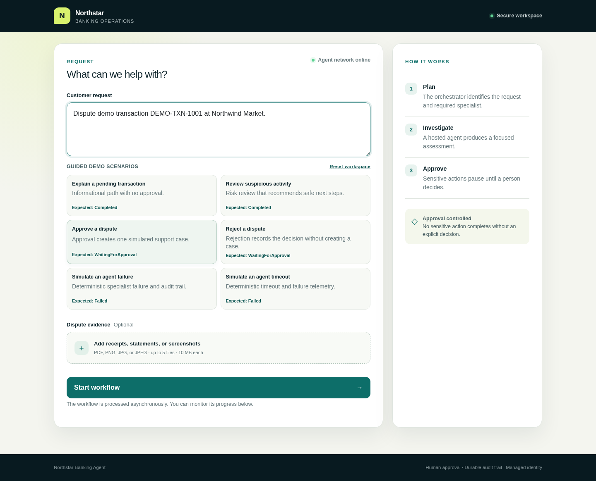
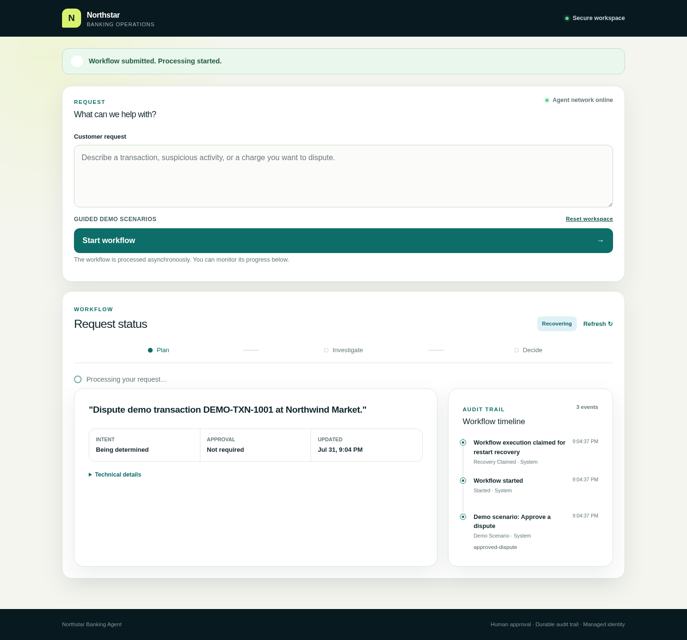
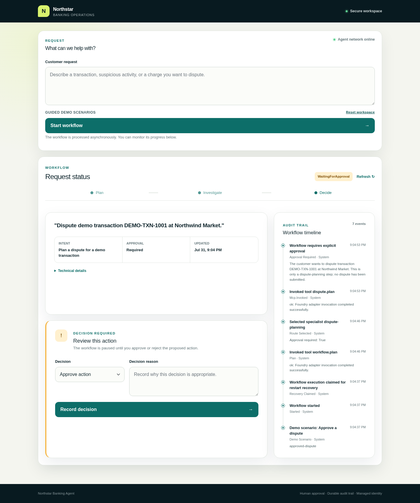
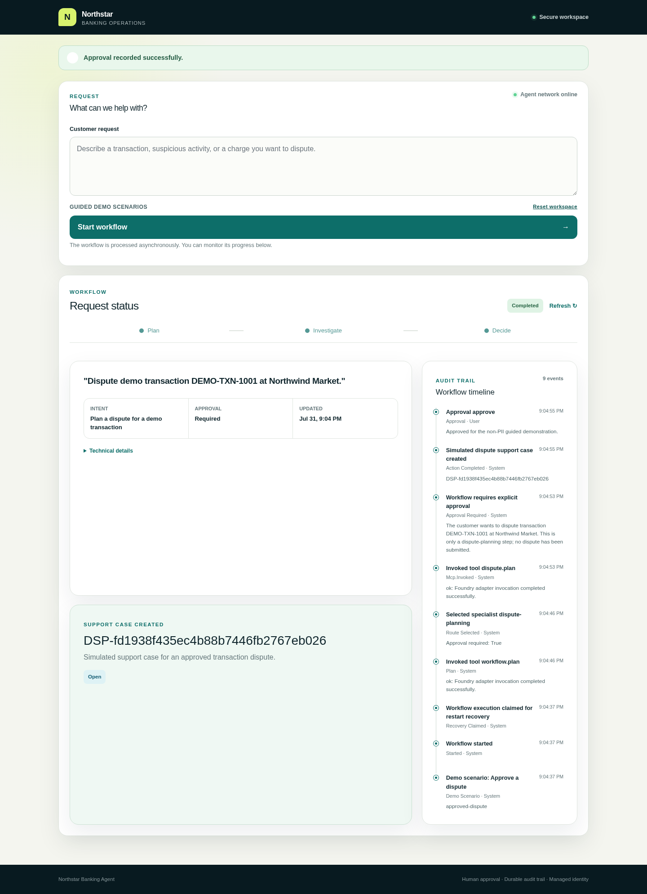
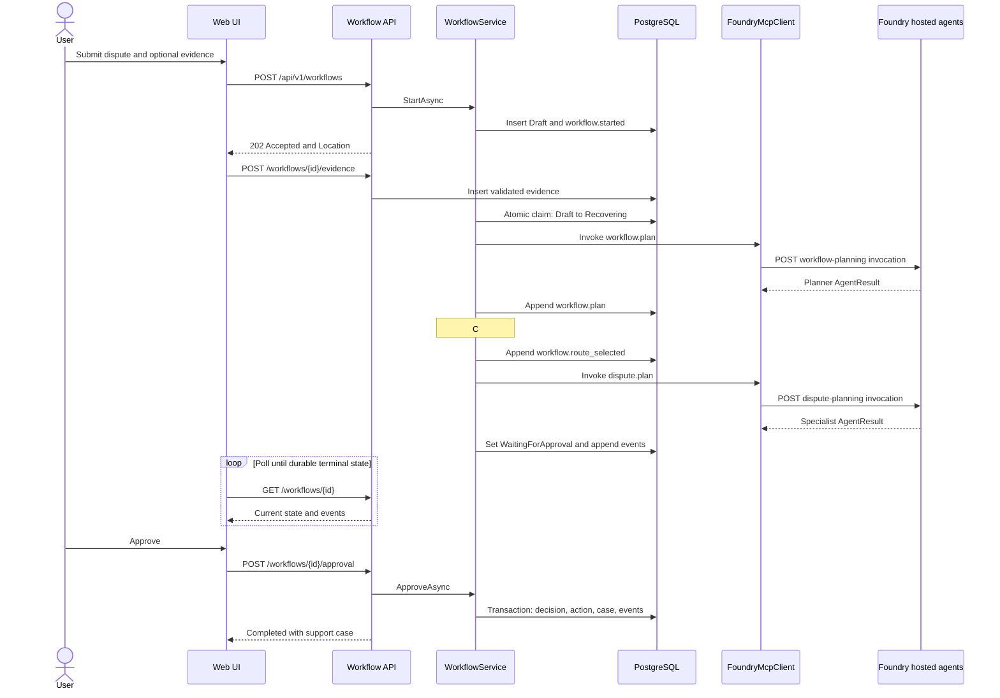
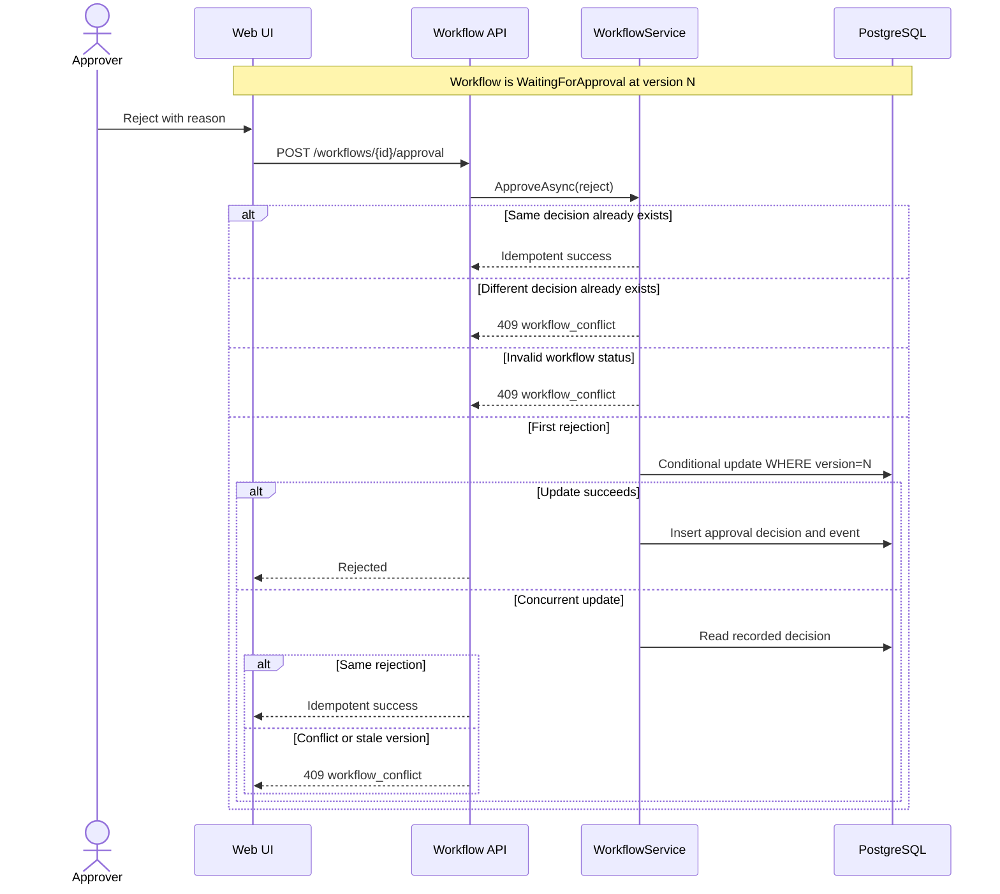
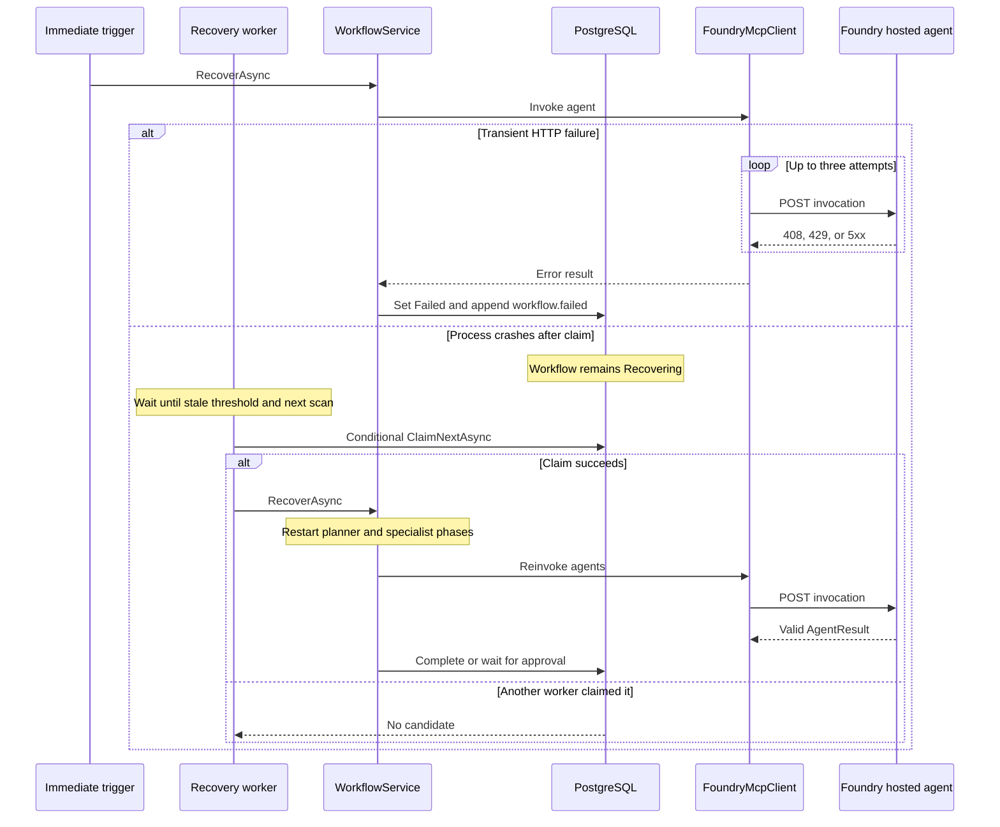

# MVP implementation and operations guide

This guide is the source of truth for developers implementing the banking-agent MVP
and operators deploying or supporting it. It describes the current repository, not
the target architecture in isolation. Commands are run from the repository root
unless noted otherwise.

## 1. System overview

The MVP is an asynchronous, database-driven workflow:

1. The ASP.NET Core Web UI submits a request to the versioned workflow API.
2. The C# orchestrator persists a `Draft` workflow and returns `202 Accepted`.
3. A best-effort trigger or the durable recovery worker atomically claims the work.
4. The orchestrator invokes a planning agent hosted in Microsoft Foundry.
5. Deterministic C# policy selects a specialist agent and whether approval is needed.
6. The selected Foundry-hosted LangGraph agent returns a recommendation.
7. PostgreSQL stores every workflow transition and audit event.
8. Sensitive requests pause in `WaitingForApproval`; approval or rejection is
   recorded transactionally.
9. The Web UI polls the durable workflow resource until it reaches a polling-terminal
   state.

PostgreSQL is the system of record. Hosted agents are stateless request/response
workers: they do not query PostgreSQL, call one another, or own workflow transitions.

### Runtime components

| Component | Responsibility | Code |
| --- | --- | --- |
| Web UI | Submit, upload evidence, poll, approve, render results | [`src/webui`](../src/webui) |
| Workflow API | Validate HTTP contracts and map failures to ProblemDetails | [`WorkflowEndpoints.cs`](../src/api/WorkflowEndpoints.cs), [`ApiProblemDetails.cs`](../src/api/ApiProblemDetails.cs) |
| Application orchestrator | Plan, route, invoke, transition, approve, and fail workflows | [`WorkflowService.cs`](../src/application/WorkflowService.cs) |
| Routing policy | Make the authoritative specialist and approval decision | [`WorkflowRoutingPolicy.cs`](../src/application/WorkflowRoutingPolicy.cs) |
| Foundry boundary | Authenticate and invoke statically configured hosted-agent endpoints | [`FoundryMcpClient.cs`](../src/infrastructure/FoundryMcpClient.cs) |
| Persistence | Store workflow state and enforce concurrency/idempotency | [`src/infrastructure/Persistence`](../src/infrastructure/Persistence) |
| Recovery | Claim new or stale work after process/revision failure | [`WorkflowExecutionTrigger.cs`](../src/orchestrator/WorkflowExecutionTrigger.cs), [`WorkflowRecoveryWorker.cs`](../src/orchestrator/WorkflowRecoveryWorker.cs) |
| Hosted agents | Run LangGraph agent graphs (four multi-node graphs) using the configured model | [`src/agents/python/app`](../src/agents/python/app) |
| Agent deployer | Create or version Foundry hosted agents | [`deploy.py`](../src/agents/deployer/deploy.py) |
| Database migrator | Apply EF migrations and grant runtime privileges | [`src/database-migrator/Program.cs`](../src/database-migrator/Program.cs) |

The C# solution follows Domain -> Application -> Infrastructure/API -> Host. Domain
code has no HTTP, EF Core, or Azure dependencies.

## 2. Workflow lifecycle

### Creation and execution

`POST /api/v1/workflows` calls `WorkflowService.StartAsync`, which persists the
workflow and `workflow.started` event before returning. The API response contains the
workflow ID, trace ID, initial `Draft` status, and a `Location` header for
`GET /api/v1/workflows/{id}`.

The API then calls `IWorkflowExecutionTrigger.Trigger(id)`. The implementation in
[`WorkflowExecutionTrigger.cs`](../src/orchestrator/WorkflowExecutionTrigger.cs)
creates a service scope and asks the repository to claim that exact `Draft`. This is
only a latency optimization. If the process exits before or during execution,
[`WorkflowRecoveryWorker.cs`](../src/orchestrator/WorkflowRecoveryWorker.cs) scans
PostgreSQL and resumes eligible work.

| Status | Meaning | Polling behavior |
| --- | --- | --- |
| `Draft` | Persisted but not yet claimed | Continue |
| `Recovering` | Claimed and executing planner/specialist phases | Continue |
| `WaitingForApproval` | Sensitive recommendation is durably paused | Stop and request a decision |
| `Completed` | Informational result or approved action completed | Stop |
| `Rejected` | Approver rejected the recommendation | Stop |
| `Failed` | Planner, specialist, validation, timeout, or cancellation failed | Stop |

The Web UI polls through [`site.js`](../src/webui/wwwroot/js/site.js) with bounded
exponential backoff. It renders persisted events rather than inventing progress.

### UI workflow walkthrough

The following screenshots were captured with Playwright against the deployed Web UI
using the non-PII **Approve a dispute** guided scenario. They show the durable states
an operator or demonstrator should expect during a successful approval-controlled
workflow.

#### 1. Request ready

The guided scenario fills the customer request while leaving evidence optional. No
workflow exists until **Start workflow** is selected.



#### 2. Workflow processing

After submission, the UI displays the persisted workflow and its `Recovering` status.
The stage tracker and audit timeline are driven by status and events returned by the
workflow API.



#### 3. Waiting for approval

The dispute specialist result requires a human decision. The workflow is durably
paused in `WaitingForApproval`; the page shows the proposed action, current timeline,
and approval form.



#### 4. Completed

After approval, the workflow reaches `Completed`. The UI displays the simulated
support case and the complete audit trail, including the approval and action events.



### Planning and authoritative routing

`WorkflowService.ExecuteRoutingAsync` performs this sequence:

1. Invoke `workflow.plan`.
2. Validate the planner response and append `workflow.plan`.
3. Run `WorkflowRoutingPolicy.Decide`.
4. Append `workflow.route_selected`.
5. Invoke the selected specialist tool.
6. Append `mcp.invoked`.
7. Transition to `Completed` or `WaitingForApproval`.

The planning agent is advisory. If its selected agent differs from
`WorkflowRoutingPolicy`, C# logs the difference and uses the deterministic C# result.
The current routing rules are:

| User request | Hosted specialist | Tool name | Approval |
| --- | --- | --- | --- |
| Dispute, chargeback, or refund | `dispute-planning` | `dispute.plan` | Always |
| Fraud or suspicious transaction | `suspicious-activity` | `suspicious.assess` | For freeze, block, or close |
| Other transaction question | `transaction-explanation` | `transaction.explain` | No |

The policy implementation is
[`WorkflowRoutingPolicy.Decide`](../src/application/WorkflowRoutingPolicy.cs); tests
are in [`BankingAgent.Domain.Tests`](../tests/BankingAgent.Domain.Tests).

## 3. How the agents work and communicate

For a line-by-line walkthrough of the Python LangGraph code, C# planner-to-specialist
handoff, shared container image, Foundry registration API, Terraform job, and runtime
identity flow, see
[`docs/agent-implementation.md`](agent-implementation.md).

### Hosted-agent implementation

One image, [`Dockerfile.hosted`](../src/agents/python/Dockerfile.hosted), is registered
four times in Foundry. `BANKING_AGENT_KIND` selects the graph exposed by each
registration:

- `workflow-planning`
- `transaction-explanation`
- `suspicious-activity`
- `dispute-planning`

[`registry.py`](../src/agents/python/app/agents/registry.py) maps names to compiled
graphs. All four are multi-node graphs with a conditional edge whose branch is
decided in code from data an earlier node extracted. See
[agent-implementation.md](agent-implementation.md) for the diagrams.
[`hosted.py`](../src/agents/python/app/hosted.py) exposes the Foundry
`InvocationAgentServerHost` entry point, while
[`model.py`](../src/agents/python/app/model.py) invokes the configured Foundry model
or returns the deterministic local result when no model client is available.

### Communication boundaries

The agents do **not** communicate directly with one another. The C# orchestrator:

1. invokes the planner;
2. reads its `AgentResult`;
3. applies C# routing policy;
4. creates a new request for one specialist; and
5. persists both responses and all transitions.

[`FoundryMcpClient.InvokeAsync`](../src/infrastructure/FoundryMcpClient.cs) sends an
Entra-authenticated HTTP `POST` to:

```text
{project-endpoint}/agents/{agent}/endpoint/protocols/invocations?api-version=v1
```

The request includes the user message, workflow ID, persisted trace ID, optional
correlation ID, tool name, selected agent, and planner context. The Python boundary
types are [`AgentRequest` and `AgentResult`](../src/agents/python/app/contracts.py).
`WorkflowService.TryReadAgentResult` accepts a result only when:

- the transport result is `ok`;
- the response body parses;
- the agent result status is `ok`;
- `intent` and `summary` are nonempty; and
- the returned agent name exactly matches the expected agent;
- a supplied contract version is supported; and
- a supplied execution mode is either `model` or `fallback`.

Hosted invocation spans and durable invocation-event details record the contract
version and execution mode without recording the user message or evidence content.

Transient HTTP 408, 429, 500, 502, 503, and 504 responses are retried up to three
attempts. Other transport, authentication, timeout, or contract failures become
durable workflow failures.

> **Current implementation note:** this boundary speaks genuine MCP JSON-RPC 2.0 for
> every specialist. The orchestrator performs `initialize`, discovers tools with
> `tools/list`, and invokes them with `tools/call` over the authenticated Foundry
> hosted-agent endpoint. The versioned typed HTTP envelope remains only as a fallback
> for a tool absent from `FOUNDRY_MCP_TOOL_ENDPOINTS`. Streamable HTTP and SSE
> transports are not used; see
> [ADR 0002](decisions/0002-mcp-sdk-vs-hand-written.md). Microsoft Agent Framework
> drives the orchestration loop through
> [`AgentFrameworkWorkflowOrchestrator`](../src/application/AgentFrameworkWorkflowOrchestrator.cs).
> All model calls are made by the hosted agents directly against Foundry; there is no
> AI gateway.

### Agent data and evidence

Agents receive request context but have no database credentials and retain no state
between calls. Evidence metadata and file content are currently **not** included in
hosted-agent requests. Evidence is available to the application and approver through
the durable workflow view. Do not claim that a specialist inspected an uploaded file
until an explicit, tested evidence-to-agent contract is implemented.

### How agents share state today

Agents do not share a mutable state store directly. PostgreSQL mediates the workflow,
but only the C# application and persistence layers access it:

1. The orchestrator loads the durable `WorkflowState` from PostgreSQL.
2. It invokes the planner with the user message, workflow ID, trace ID, and current
   status.
3. It validates the planner result and persists a `workflow.plan` event.
4. It creates a new specialist request containing selected planner fields
   (`planner_summary`, planner evidence strings, and selected-agent metadata) plus the
   deterministic C# routing decision.
5. It validates the specialist result and persists the next workflow state and
   events.

This is **orchestrator-mediated context passing**, not shared agent memory. The
versioned invocation envelope exposes the planner handoff as top-level
`AgentRequest.context`; the Python boundary also promotes legacy `input.context`.
The specialist model prompt consumes the normalized context. The detailed
[agent implementation walkthrough](agent-implementation.md#versioned-planner-to-specialist-context-handoff)
traces the contract to the exact code. The specialist still cannot observe later
database changes, another agent's private state, uploaded files, or uncommitted work.
State transitions, approvals, and audit authority remain in C# and PostgreSQL.

### Shared-state evolution

Preserve PostgreSQL as the canonical workflow database while introducing richer
coordination in layers. The first two layers are now implemented:

1. **Agent Framework orchestration (implemented,
   [#17](https://github.com/briandenicola/banking-agent-foundry-orchestrator/issues/17)):**
   planner, routing, specialist, approval, and action execution run as explicit
   Agent Framework steps in
   [`AgentFrameworkWorkflowOrchestrator`](../src/application/AgentFrameworkWorkflowOrchestrator.cs).
   Recovery still replays the planning and specialist phases rather than resuming a
   framework checkpoint.
2. **MCP specialist boundary (implemented,
   [#18](https://github.com/briandenicola/banking-agent-foundry-orchestrator/issues/18)
   and [#36](https://github.com/briandenicola/banking-agent-foundry-orchestrator/issues/36)):**
   all four specialists are exposed as discovered, typed MCP tools. Agents return
   recommendations or artifacts; only the orchestrator commits authoritative state.
3. **Explicit shared artifacts (not implemented):** add versioned
   workflow-context/artifact records with provenance, content classification, schema
   version, producing step, and hash.
   Pass references or a least-privilege projection to tools rather than copying the
   entire workflow or evidence content into every prompt.
4. **Transactional event publication:** use an outbox written in the same PostgreSQL
   transaction as workflow events. A projector can publish only committed state,
   retry safely, and rebuild a client view from the event history.
5. **Agent Host Protocol projection:** evaluate mapping each workflow to an AHP
   session and its progress/conversation to AHP channels. Multiple UIs, operator
   consoles, or CLIs could receive a snapshot and ordered action stream while
   PostgreSQL remains authoritative.
6. **Command reconciliation:** commands received through an AHP host, such as an
   approval, must include the expected workflow version. The orchestrator validates
   authorization and policy, commits through the existing repository transaction,
   and only then publishes the committed action back to subscribers.

AHP should not be treated as agent-to-agent database access. It is a synchronized
host/client session-state protocol built around JSON-RPC channels, immutable state,
pure reducers, subscriptions, and write-ahead reconciliation. Its specification is
currently a draft with breaking changes expected, and its published client list does
not currently include .NET or Python. Adoption therefore starts with the feasibility
spike in
[#19](https://github.com/briandenicola/banking-agent-foundry-orchestrator/issues/19),
not a production dependency.

## 4. PostgreSQL state, audit, and recovery

Azure Database for PostgreSQL Flexible Server v16 is provisioned in
[`infrastructure/postgresql.tf`](../infrastructure/postgresql.tf). Password
authentication is disabled. The orchestrator and database-migrator identities obtain
Entra tokens; the migrator owns schema changes and grants the orchestrator only the
runtime privileges it needs.

### Durable schema

EF mappings live in
[`BankingAgentDbContext.cs`](../src/infrastructure/Persistence/BankingAgentDbContext.cs)
and migrations in
[`src/infrastructure/Persistence/Migrations`](../src/infrastructure/Persistence/Migrations).

| Table | Contents | Important guarantee |
| --- | --- | --- |
| `workflows` | Current state, intent, summary, route, trace, version | Unique `trace_id`; versioned updates |
| `workflow_events` | Ordered immutable audit timeline | Unique `(workflow_id, sequence)` |
| `workflow_evidence` | Validated metadata, SHA-256, and `bytea` content | Unique `(workflow_id, sha256)` |
| `approval_decisions` | Approver decision and reason | One decision per workflow |
| `action_executions` | Bounded action result (`jsonb`) | Unique idempotency key |
| `support_cases` | Simulated dispute support case | Unique workflow and case number |
| Demo transaction tables | Non-PII guided scenario data | Seeded by migration |

The migrations are:

1. `InitialWorkflowPersistence`
2. `AddWorkflowEvidence`
3. `SeedDemoTransactions`

The orchestrator never calls `Database.Migrate()`. Run the dedicated migration job
before admitting traffic to a new application revision.

### Atomic claims and optimistic concurrency

[`EfWorkflowRepository`](../src/infrastructure/Persistence/EfWorkflowRepository.cs)
uses conditional SQL updates matching workflow ID, expected version, and eligible
status. `ClaimAsync(id)` can claim only the requested `Draft`.
`ClaimNextAsync(staleBefore)` can claim a new `Draft` or stale `Recovering` row.
Only a caller whose update affects one row owns execution.

`UpdateAsync` uses the same explicit version predicate and increments the version in
C#. These predicates, not EF change tracking alone, provide the effective optimistic
concurrency guarantee.

[`EfWorkflowActionRepository.RecordDecisionAsync`](../src/infrastructure/Persistence/EfWorkflowActionRepository.cs)
writes the workflow transition, decision, event, action execution, and support case in
one transaction. A repeated identical decision is idempotent; a different decision or
stale version returns `workflow_conflict`.

The approved "action" currently creates a durable support case in PostgreSQL. It does
not invoke a production banking system.

### Recovery behavior

The default scan interval is 30 seconds and the stale threshold is 120 seconds, both
explicit in [`apps/orchestrator.tf`](../apps/orchestrator.tf). A process that crashes
after claiming a workflow can therefore take approximately 150 seconds in the worst
case to be reclaimed.

Recovery restarts planner and specialist execution; it does not resume at a persisted
phase checkpoint. Separate attempts can produce repeated planning, routing, or
invocation events. This is safe because current agent calls have no side effects and
the post-approval database action has an idempotency key.

### Evidence controls

[`WorkflowEvidenceService`](../src/application/WorkflowEvidenceService.cs) enforces:

- dispute workflows only;
- at most five files;
- at most 10 MB per file;
- PDF, PNG, JPG, or JPEG extension and matching magic bytes;
- SHA-256 deduplication.

Evidence content and metadata remain in PostgreSQL; spans and structured logs exclude
both.

## 5. Approval, action, and audit behavior

`WorkflowService.ApproveAsync` accepts decisions only for
`WaitingForApproval` workflows:

- `approve` creates the approval, action execution, support case, and completion
  events transactionally;
- `reject` creates the approval and rejection event without an action;
- repeating the same decision returns the existing outcome;
- changing a recorded decision returns HTTP 409;
- an invalid status or stale version returns HTTP 409.

The workflow detail endpoint returns current state, ordered events, evidence metadata,
and the support case. This durable response is the audit evidence used by the UI,
smoke runner, and operators.

## 6. Sequence diagrams

### Successful dispute and approval



### Rejection and concurrency



### Agent failure and crash recovery



## 7. Authentication and tenant prerequisites

### Default deployment

Service-to-service API authentication is disabled by default. Azure dependencies
still use managed identity and Entra authentication:

- ACR admin credentials are disabled.
- Foundry local authentication is disabled.
- PostgreSQL password authentication is disabled.
- The orchestrator uses a managed identity for Foundry and PostgreSQL.
- The agent deployer uses a managed identity for Foundry management.
- Hosted-agent instance identities receive model invocation access after deployment.

Identity and role definitions are in
[`apps/identities.tf`](../apps/identities.tf),
[`apps/roles.tf`](../apps/roles.tf), and
[`infrastructure/postgresql.tf`](../infrastructure/postgresql.tf).

### Orchestrator API authentication

Orchestrator API authentication is enabled by default. Keep
`enable_service_auth=true` for every deployed environment where the tenant permits
it. Setting it to `false` requires `allow_insecure_service_auth=true` as an
explicit acknowledgement, and is intended only for local Development or for demo
environments in tenants that cannot provision the required Entra objects. See
[When the tenant forbids these objects](#when-the-tenant-forbids-these-objects).

With service auth enabled,
[`apps/entra.tf`](../apps/entra.tf) then:

1. creates an orchestrator API application registration;
2. exposes the application role `Workflow.Invoke`;
3. creates its service principal; and
4. assigns that role to the Web UI managed identity.

The orchestrator validates the issuer, audience, token lifetime, and
`Workflow.Invoke` role in
[`src/orchestrator/Program.cs`](../src/orchestrator/Program.cs). The Web UI requests
`api://<orchestrator-app-id>/.default` through
[`OrchestratorTokenHandler.cs`](../src/webui/OrchestratorTokenHandler.cs).

Tenant prerequisites:

- permission to create application registrations and service principals;
- permission to assign an application role;
- a deployment identity authorized for the AzureAD Terraform provider;
- no client secrets or certificate credentials.

#### When the tenant forbids these objects

Some tenants allow creating an application registration but refuse to create its
service principal or set its `api://` identifier URI. Terraform fails with:

```
403 Authorization_RequestDenied: Insufficient privileges to complete the operation
```

This leaves the deployment half-applied, and the orphaned application registration
usually cannot be deleted by the same identity either, so it must be removed from
Terraform state and cleaned up by a directory administrator.

For demo and lab environments in such a tenant, disable service authentication by
setting **both** values in `.env`:

```bash
ENABLE_SERVICE_AUTH=false
ALLOW_INSECURE_SERVICE_AUTH=true
```

`.env` is gitignored, so this stays a property of your environment rather than a
change to the repository's secure defaults, and it applies to every `task` command
without needing flags on each invocation.

The two variables are deliberately separate. `ENABLE_SERVICE_AUTH=false` alone
fails the Terraform plan through a precondition on the orchestrator container app,
and the orchestrator refuses to start. Turning authentication off and acknowledging
what that means are two distinct acts.

With authentication disabled, **anyone who can reach the orchestrator ingress can
start and approve workflows**. Never use this for real or regulated data. The
system reports the state honestly rather than hiding it: readiness returns
`service_auth: Degraded`, and the orchestrator logs a startup warning.

### Internal ingress: what it does and does not fix

Because service authentication cannot be provisioned in such a tenant, the
orchestrator runs on **internal ingress** (`external_enabled = false` in
`apps/orchestrator.tf`). It is reachable only from inside the Container Apps
environment, so its unauthenticated workflow and approval endpoints are not
exposed to the internet. The Web UI reaches it over the environment-internal
FQDN.

**This is a reduction in exposure, not authentication.** The Web UI remains
public and unauthenticated — `src/webui/Program.cs` calls `UseAuthorization()`
without registering an authentication scheme — and the Web UI can start *and*
approve workflows. Anyone who can reach the Web UI can still drive the system.
Internal ingress removes the public API, not the ability to use it. Do not
describe this deployment as secured. Issue #40 tracks the remaining work.

### Signing users in to the Web UI (Container Apps built-in authentication)

The Web UI can be put behind Entra sign-in without the app registration that
service authentication needs Terraform to create. The registration is created by
hand and supplied as an input, so a tenant that denies `azuread_application`
still supports this.

1. Create an app registration in the portal, or with `az ad app create`. Add a
   **Web** redirect URI of `https://<webui-fqdn>/.auth/login/aad/callback`; the
   FQDN comes from `terraform -chdir=apps output`.
2. Enable **ID tokens** on the registration: Authentication → Implicit grant and
   hybrid flows → *ID tokens (used for implicit and hybrid flows)*, or
   `az ad app update --id <client-id> --set web.implicitGrantSettings.enableIdTokenIssuance=true`.
   Easy Auth uses the hybrid flow and requests `response_type=id_token`. Without
   this the redirect to Entra succeeds and the callback fails with
   `AADSTS700054: response_type 'id_token' is not enabled for the application`,
   which surfaces to the user as a bare `401` from the Web UI. This step applies
   to the Easy Auth path only; with `enable_user_delegation` the Web UI runs its
   own sign-in and Easy Auth is not used at all.
3. Create a client secret on that registration.
4. Add these to `.env`, which is gitignored and already loaded by every `task`
   command:

   ```bash
   TF_VAR_webui_auth_client_id=<application (client) id>
   TF_VAR_webui_auth_client_secret=<client secret value>
   # Only when the registration lives outside the subscription's tenant:
   TF_VAR_webui_auth_tenant_id=<directory (tenant) id of the registration>
   ```

   **The `TF_VAR_` prefix is required here**, unlike the other settings in
   `.env`. `ENABLE_SERVICE_AUTH` and its neighbours are bare names because
   `tasks/Taskfile.app.yml` forwards them explicitly with `-var`; these are
   not on that list and reach Terraform through its native `TF_VAR_*`
   environment variable support instead. A bare `WEBUI_AUTH_CLIENT_ID=...` in
   `.env` is silently ignored and the Web UI stays public.

   The secret is deliberately passed this way rather than added to the `-var`
   list, so it never appears in the command line of a running process.

5. Run `task app:apply`. `apps/webui-auth.tf` creates the `authConfigs/current`
   child resource and the Web UI starts redirecting anonymous visitors to Entra.

#### Calling the orchestrator as the signed-in user

With sign-in working, `enable_user_delegation` moves sign-in *into* the Web UI:
instead of Container Apps built-in authentication sitting in front, the
application runs its own OpenID Connect authorization-code flow and acquires an
orchestrator token for the signed-in user. The orchestrator can then *verify*
which customer a request is for rather than take the Web UI's word for it. It is
off by default and every deployment without it behaves exactly as before.

> On-behalf-of was the original design and was abandoned. It needs an incoming
> user token, which behind Easy Auth means the token store, whose only supported
> backing is a blob **SAS URL** — and subscription policy here forbids shared-key
> storage access and silently reverts attempts to enable it. See
> [ADR 0005](decisions/0005-delegated-user-authentication.md). An application
> that runs its own sign-in does not need the exchange at all: it holds its own
> refresh token and can request the orchestrator's scope directly.

This needs a **second** app registration. The existing registration is the
*client* — the Web UI, which users sign in to. The new one is the *resource* —
the orchestrator API, which the token is addressed to. One registration cannot be
both, because the token names one audience and is validated by the other.

1. On the **Web UI** registration, add two **Web** redirect URIs:
   `https://<webui-fqdn>/signin-oidc` and `https://<webui-fqdn>/signout-oidc`.
   The `.auth/login/aad/callback` URI is no longer used but is harmless to leave.
2. Create the **orchestrator** registration in the same sign-in tenant. It needs
   no redirect URI; nothing signs in to it.
3. Set its identifier URI to `api://<orchestrator-app-id>` and expose a scope
   named `user_impersonation` on it.
4. Pre-authorize the Web UI's client ID for that scope, so users are not prompted
   to consent.
5. Verify the orchestrator registration:

   ```bash
   az ad app show --id <orchestrator-app-id> \
     --query "{uris:identifierUris, scopes:api.oauth2PermissionScopes[].value, preauth:api.preAuthorizedApplications[].appId}" -o json
   ```

   `preauth` must contain the Web UI's client ID.
6. Add to `.env`:

   ```bash
   TF_VAR_enable_user_delegation=true
   TF_VAR_orchestrator_api_app_id=<orchestrator application (client) id>
   ```

7. Run `task app:apply`, then sign out and sign back in. A session established
   before the change was issued by a different authentication scheme and will not
   carry an orchestrator token.

The Web UI reuses the same `webui_auth_client_id` and `webui_auth_client_secret`
as the Easy Auth path: it is a confidential client and must prove it is the
registered application. That secret is the deployment's only key at rest;
[ADR 0005](decisions/0005-delegated-user-authentication.md) records why it is
accepted and when it should go.

**A revision restart forces re-sign-in.** The token cache and the data protection
key ring are both in-process, so an ordinary restart or scale event invalidates
the auth cookie. Users see the sign-in page again and nothing else breaks.

Three things fail the plan rather than the deployment:

- `enable_user_delegation` with `enable_service_auth` — both configure the same
  JWT bearer scheme with different issuers and audiences, so one set of callers
  would be rejected whichever won. The orchestrator refuses to start in this
  combination too.
- `enable_user_delegation` without `webui_auth_client_id` — no registration to
  sign users in against.
- `enable_user_delegation` without `orchestrator_api_app_id` — no audience to
  request a token for.

**What it covers.** The interactive path only. The recovery worker resumes
workflows in the background long after any user token has expired, so it keeps
asserting the customer identifier recorded on the workflow. Delegation also stops
at the orchestrator: Foundry calls still use the orchestrator's managed identity
with the customer's object ID asserted as a memory scope, because Foundry's data
plane authorises on Azure RBAC and a bank's customers are not principals in its
tenant.

#### Signing in users from a different tenant

`webui_auth_tenant_id` exists because the tenant that signs *people* in is
independent of the tenant the Azure resources live in. Where the subscription's
tenant denies app registration, or simply has no test users to demonstrate
per-customer behaviour with, the registration and its users can live in a tenant
the operator controls; Easy Auth validates against whichever issuer is
configured. Leave it empty for the single-tenant default.

Only sign-in moves. The managed identities, Foundry, and every data-plane call
stay in the deployment's own tenant, because a managed identity is an Azure
resource that can only obtain tokens from its home tenant. That has one
consequence worth stating plainly: **it does not unblock service authentication**
(`enable_service_auth`). The Web UI reaches the orchestrator using its managed
identity, which cannot acquire a token for an `api://` application registered
somewhere else, so moving registrations to a controlled tenant does not work
around the constraint in issue #30.

To turn sign-in back off, comment both lines out and apply again.

Leaving `webui_auth_client_id` empty keeps the historical behaviour: no
authentication, Web UI public. Setting the client ID without the secret fails the
plan on a precondition rather than deploying a login that cannot complete.

The health probe paths are excluded from authentication in
`local.webui_auth_excluded_paths`. Without that exclusion the platform's own
probes receive a login redirect, the revision never becomes ready, and the
deployment fails in a way that looks nothing like an authentication problem.

**What this does and does not change.** It authenticates the person using the Web
UI, which is the substance of issue #40. It does **not** let the application call
Foundry as that person. Workflows execute in the background through the recovery
worker, long after the sign-in token has expired, so carrying a user token into a
workflow would mean persisting user credentials in the workflow store. The
signed-in object identifier is instead recorded on the workflow
(`WorkflowState.CustomerId`) and used as a memory scope the orchestrator asserts
on the user's behalf. The orchestrator ingress itself remains unauthenticated;
only the Web UI in front of it is protected.

Two consequences worth knowing:

- `ORCHESTRATOR_URL` is now the internal FQDN and is **not routable from an
  operator workstation**. Anything outside the environment must go through the
  Web UI.
- `scripts/smoke-mvp.py` detects the `.internal.` marker and adapts. Orchestrator
  health is verified transitively through the Web UI readiness probe, which runs
  `OrchestratorReadinessCheck` against the orchestrator's own `/health/ready`
  from inside the environment. The authentication baseline check asserts the
  approval endpoint is unreachable from the internet and continues to report
  `authentication_required: false`, so the residual exposure stays visible.

**What "unreachable" looks like in practice.** A Container Apps environment
fronts every app it hosts, internal and external, behind a single public IP.
The orchestrator's `.internal.` FQDN therefore still resolves publicly and
still accepts a TCP connection; the front door simply declines to route the
request and answers with its own page:

```
Error 404 - This Container App is stopped or does not exist.
```

That 404 is the lockdown working. `assert_not_publicly_reachable` accepts a DNS
or connection failure, and a 404 carrying that marker, as proof the request
never reached the app. Every other response - an app-served 404, a 401, a 200,
or any status carrying the marker but not 404 - fails the check, because it
means the orchestrator itself answered.

Verify by hand with:

```bash
ORCHESTRATOR_URL=$(terraform -chdir=apps output -raw ORCHESTRATOR_URL)
curl -s "${ORCHESTRATOR_URL}/health/ready" | grep -o "This Container App is stopped or does not exist"
```

The remaining public surface is the Web UI. Restricting it further requires an
ingress IP allowlist (`ip_security_restriction`), which is supported by the
provider in use but is not configured here, because pinning the allowlist to one
egress IP breaks the lab whenever it is presented from a different network.

## 8. Telemetry and correlation

The Web UI and orchestrator configure OpenTelemetry and Azure Monitor in their
respective `Program.cs` files. Incoming and outgoing HTTP spans use W3C trace context;
custom workflow spans use `BankingAgent.Workflow`.

Correlation flow:

1. `WebUiCorrelationMiddleware` accepts a valid `x-correlation-id` or creates one.
2. `CorrelationIdHandler` forwards it to the orchestrator.
3. `CorrelationIdMiddleware` stores it on the current activity.
4. `FoundryMcpClient` forwards it when an ambient activity is available.
5. The workflow's persisted W3C trace ID is included in every agent request.

Recovery-worker execution may have no inbound HTTP activity, so the correlation ID is
best-effort; workflow ID and persisted trace ID are the reliable operational keys.
The Python hosted agent currently does not attach the correlation ID to its own logs.

Safe span fields and ready-to-run Kusto queries are in
[`docs/observability.md`](observability.md). User messages, evidence, approval
reasons, account data, tokens, and raw downstream responses must never be logged.

## 9. Build and local verification

Prerequisites:

- Azure CLI authenticated with `az login`;
- Terraform 1.6 or later;
- Task;
- .NET 10 SDK;
- Python 3.12;
- Node.js/npm for the jsdom test suite;
- subscription and directory permissions appropriate to the selected auth mode.

Create local environment configuration:

```bash
cp .env.example .env
```

Run the complete non-Azure quality gate:

```bash
task test:all
```

It runs .NET unit/contract tests, jsdom UI tests, E2E lifecycle tests, Python agents,
the deployer, and hosted-agent contract tests. See
[`docs/testing.md`](testing.md) for individual suites and prerequisites.

Validate Terraform without applying:

```bash
terraform -chdir=infrastructure fmt -check -recursive
terraform -chdir=infrastructure init -backend=false
terraform -chdir=infrastructure validate

terraform -chdir=apps fmt -check -recursive
terraform -chdir=apps init -backend=false
terraform -chdir=apps validate
```

## 10. Deployment

### First deployment

1. Configure remote state and OIDC as described in
   [`docs/remote-state.md`](remote-state.md). Migrate existing local state before
   enabling GitHub deployment.
2. Initialize the infrastructure stack and select a region workspace:

   ```bash
   terraform -chdir=infrastructure init -upgrade
   terraform -chdir=infrastructure workspace new swedencentral || true
   terraform -chdir=infrastructure workspace select swedencentral
   task cloud:apply -- swedencentral
   ```

3. Build immutable images:

   ```bash
   task app:build
   ```

   Both `task app:build` and `task app:apply` derive the image tag
   independently from `git rev-parse HEAD | cut -c 1-8`. **Any commit made
   between the two steps - including a documentation-only commit - moves the
   tag that apply requests without rebuilding the images.** `task app:apply`
   runs `scripts/guard-image-tags.sh` first and refuses to start when the tags
   are absent, naming the missing images. Rebuild, or apply an existing tag
   explicitly with `-var "image_tag=<tag>"`.

4. Initialize and review the application plan:

   ```bash
   task app:init

   APP_NAME=$(terraform -chdir=infrastructure output -raw APP_NAME)
   IMAGE_TAG=$(git rev-parse HEAD | cut -c 1-8)

   terraform -chdir=apps plan \
     -var "app_name=${APP_NAME}" \
     -var "region=swedencentral" \
     -var "image_tag=${IMAGE_TAG}"
   ```

5. Apply applications, migrate the database, and deploy agents:

   ```bash
   task app:apply -- swedencentral
   task app:migrate
   task app:deploy-hosted-agents
   ```

6. Run the deployed smoke:

   ```bash
   task app:smoke -- --timeout 30 --poll-timeout 180
   ```

`task app:build` publishes the images. `task app:deploy -- swedencentral` applies
the application stack, runs migration, and deploys the hosted agents after
shared infrastructure already exists.

### Optional agent features: memory and toolbox

Foundry memory and Foundry toolbox tools are **off by default**. A default
deployment registers the four hosted agents exactly as it always has: no memory
store, no prompt agent, no toolbox, and no tool access.

Enable them by setting the flags on `app:apply` (or on `app:deploy`, which calls
it):

```bash
# Toolbox tools only
ENABLE_AGENT_TOOLBOX=true task app:apply -- swedencentral

# Memory only
ENABLE_AGENT_MEMORY=true task app:apply -- swedencentral

# Both
ENABLE_AGENT_MEMORY=true ENABLE_AGENT_TOOLBOX=true task app:apply -- swedencentral
```

Then re-run the deployer so the new configuration reaches Foundry:

```bash
task app:deploy-hosted-agents
```

To keep a flag on for every run, set it in `.env` instead. The root `Taskfile.yml`
loads `.env` via `dotenv`, and the values reach the `app:` tasks:

```bash
ENABLE_AGENT_MEMORY=true
ENABLE_AGENT_TOOLBOX=true
```

An inline environment variable still overrides the file for a single run, for
example `ENABLE_AGENT_MEMORY=false task app:apply -- swedencentral`.

The flags must be supplied on **every** subsequent `app:apply`. Terraform is
declarative, so omitting them applies the `false` default and turns the features
back off.

What each flag does:

| Flag | Effect |
| --- | --- |
| `ENABLE_AGENT_MEMORY` | Creates the memory store and registers the `customer-profile` prompt agent with the memory search tool. |
| `ENABLE_AGENT_TOOLBOX` | Creates the `banking-toolbox` toolbox, attaches it to `customer-profile` as an `mcp` tool, and sets `BANKING_AGENT_TOOLBOX_NAME` on the hosted agents so `transaction-explanation` can call its tools. |

Both flags resolve to an empty name when off, and the deployer treats an empty
name as "feature off". Turning a flag off later changes the hosted agents'
environment, so the deployer creates a new agent version rather than leaving the
old configuration running.

Notes before enabling:

- **Memory is a preview feature** (api-version `2025-11-15-preview`) that
  retains model-extracted customer detail. Review the redaction instruction in
  `apps/main.tf` (`memory_user_profile_details`) first. See
  [ADR 0003](decisions/0003-foundry-memory-prompt-agent.md).
- Memory requires the embedding deployment created by the infrastructure stack.
  If `infrastructure/` predates that deployment, re-apply it first.
- Only `transaction-explanation` calls toolbox tools, and it cannot require
  approval by construction, so tool output never reaches an approval decision.
  See [ADR 0004](decisions/0004-foundry-toolbox-tools.md).
- Both features have now been deployed against live Azure with
  `ENABLE_AGENT_MEMORY=true` and `ENABLE_AGENT_TOOLBOX=true`. That run also
  found the toolbox tool-identifier constraint recorded in
  [ADR 0004](decisions/0004-foundry-toolbox-tools.md): Foundry rejects a
  toolbox version when more than one tool lacks a `name` or `server_label`.

### Recovering a partially applied stack

An apply that fails partway leaves resources created but not recorded, or
recorded but not created. Both happened during the first end-to-end run and
neither is self-announcing, so check reality before trusting Terraform.

**Terraform state is not evidence.** `terraform output` reads state, so it
still names resources that were deleted out of band. After any failed or
interrupted apply, confirm against Azure:

```bash
APPS_RG="$(terraform -chdir=infrastructure output -raw APP_NAME)-apps-rg"
az resource list -g "${APPS_RG}" --query "[].{name:name,type:type}" -o table
```

A healthy apps stack shows the orchestrator and Web UI container apps, both
Container Apps jobs, and one user-assigned identity per workload. `task
app:migrate` and `task app:deploy-hosted-agents` resolve their job names from
state, so a job that exists in state but not in Azure fails with
`(ResourceNotFound) The Resource 'Microsoft.App/jobs/...' was not found`.

| Situation | Symptom | Recovery |
| --- | --- | --- |
| Resource exists in Azure, absent from state | Apply fails because the name is already taken | Delete the resource, or `terraform -chdir=apps import` it, then re-apply |
| Resource in state, absent from Azure | A job task fails with `ResourceNotFound`, or apply reports no changes | `terraform -chdir=apps apply -refresh-only` to reconcile, then re-apply |
| Apply failed midway | Next plan shows replacements of tainted resources | Expected; let the replacement proceed once the underlying cause is fixed |

Terraform refreshes before planning, so an apply that races a deletion still in
flight can report success with nothing to do. If an apply reports no changes but
the resources are missing, re-run it once the deletion has completed.

### CI/CD deployment

[`ci.yml`](../.github/workflows/ci.yml) validates code, tests, Terraform, and every
container image. After a successful push to `main`,
[`deploy-production.yml`](../.github/workflows/deploy-production.yml) waits for the
GitHub `production` environment approval, authenticates with OIDC, applies both
Terraform stacks, builds commit-tagged images, runs migration and agent-deployer
jobs, executes smoke checks, and uploads `smoke-evidence.json`.

Do not approve the production workflow until:

- the remote backend contains the authoritative infrastructure and application state;
- required GitHub variables and backend secrets are configured;
- the Terraform plan has no unexplained replacement or deletion; and
- the image tag matches the intended commit.

### Hosted-agent deployment details

[`deploy.py`](../src/agents/deployer/deploy.py) authenticates with
`ManagedIdentityCredential`, compares existing versions, creates or versions each
agent, and waits for `active` or `running`. Registrations use the Foundry
`invocations` protocol version `2.0.0`, 0.5 CPU, 1 GiB memory, the shared hosted-agent
image, and agent-specific `BANKING_AGENT_KIND`.
Each registration also receives the Foundry project endpoint, model deployment, and
`ALLOW_FALLBACK=false`; changes to any runtime setting create a new agent version.

After the job succeeds,
[`deploy-hosted-agents.sh`](../scripts/deploy-hosted-agents.sh) grants each active
hosted-agent instance identity `Cognitive Services OpenAI User` on the Foundry
account. Without this grant, production model invocation fails; it cannot silently
degrade to deterministic fallback.

## 11. Operating the MVP

### Readiness and inventory

```bash
ORCHESTRATOR_URL=$(terraform -chdir=apps output -raw ORCHESTRATOR_URL)
WEBUI_URL=$(terraform -chdir=apps output -raw WEBUI_URL)
RESOURCE_GROUP=$(terraform -chdir=apps output -raw APPS_RESOURCE_GROUP_NAME)

curl --fail --silent "${ORCHESTRATOR_URL}/health/ready"
curl --fail --silent "${WEBUI_URL}/health/ready"
az containerapp list --resource-group "${RESOURCE_GROUP}" \
  --query "[].{name:name,revision:properties.latestRevisionName}" --output table
```

Use `GET /api/v1/workflows/{id}` to inspect durable status and ordered events. Prefer
workflow ID or trace ID over free-text log searches.

### Jobs

Start and monitor the supported jobs through:

```bash
task app:migrate
task app:deploy-hosted-agents
```

Both scripts wait for completion and query Log Analytics on failure through
[`containerapp-job-logs.sh`](../scripts/containerapp-job-logs.sh).

### Routine post-deployment checks

1. Confirm orchestrator and Web UI readiness.
2. Confirm the intended immutable image tag and latest revisions.
3. Confirm the migrator and agent-deployer executions succeeded.
4. Confirm all four hosted agents are active.
5. Run `task app:smoke`.
6. Run a no-change Terraform plan and investigate any drift.
7. Query Application Insights for failed `workflow.*`, `hosted_agent.*`, or
   `persistence.*` spans.

The Web UI runs one replica and stores Data Protection keys locally because public
Storage access is disabled by policy. A replacement revision invalidates existing
antiforgery cookies; users and smoke tests must start with a fresh page/cookie jar.

## 12. Troubleshooting

| Symptom | Investigation | Likely remediation |
| --- | --- | --- |
| Workflow remains `Draft` | Check orchestrator readiness and recovery-worker logs; inspect recovery settings | Restore the orchestrator revision; allow the worker to claim the draft |
| Workflow remains `Recovering` | Compare last update with 120-second stale threshold; inspect agent dependency spans | Fix Foundry connectivity; stale recovery can take about 150 seconds |
| Workflow becomes `Failed` | Read `workflow.failed`, workflow trace ID, and `hosted_agent.invoke` span | Correct endpoint/RBAC/model access or response contract, then submit a new workflow |
| Foundry returns 401/403 | Verify orchestrator roles and hosted-agent instance model role | Reapply Terraform RBAC and rerun `task app:deploy-hosted-agents` |
| Agent deployer fails | Run the deployer task and inspect emitted Container Apps job logs | Correct image, Foundry project access, or registration payload |
| Deployer fails with `Multiple tools without identifiers found` | A toolbox version carries more than one tool lacking `name`/`server_label` | Give every toolbox tool a unique `name` in `apps/main.tf`; see [ADR 0004](decisions/0004-foundry-toolbox-tools.md) |
| Job task fails with `Microsoft.App/jobs/... was not found` | State records a job that no longer exists in Azure | `az resource list -g <apps-rg> -o table` to confirm, then `terraform -chdir=apps apply -refresh-only` and re-apply |
| Apply fails because a resource name is already taken | The resource exists in Azure but not in state | Import it, or delete it and re-apply; wait for the delete to finish before re-applying |
| Smoke reports the orchestrator answered 404 | The internal FQDN resolves to the shared environment IP; the front door returns its own 404 | Expected when the body contains `This Container App is stopped or does not exist`; any other 404 body means the app answered |
| `task app:apply` reports missing images | The apps stack deploys images tagged with the current commit; a commit made after the last build moves that tag | Run `task app:build`, or apply with an explicit `-var "image_tag=<existing-tag>"` |
| PostgreSQL connection fails | Verify managed identity, Entra admin, host/database outputs, and runtime grants | Rerun migration only after identity and network access are correct |
| Approval returns 409 | Compare status, recorded decision, and workflow version | Refresh durable state; do not overwrite a conflicting decision |
| Evidence upload fails | Check route, count, size, extension, magic bytes, and duplicate hash | Submit supported unique evidence to a dispute workflow |
| UI form rejects after rollout | Existing antiforgery cookie uses the previous local key | Refresh the page or start a fresh browser session |
| Smoke cannot read outputs | Terraform backend/state is missing or points to another environment | Initialize the correct backend and state key; never guess endpoint values |

For correlation queries, see [`docs/observability.md`](observability.md). For test
failures, see [`docs/testing.md`](testing.md).

## 13. Rollback

Container Apps use `revision_mode = "Single"`, and all application/job images share
one Terraform `image_tag`. The supported rollback is a Terraform apply using a
previous known-good immutable tag, not an ad hoc portal change:

```bash
APP_NAME=$(terraform -chdir=infrastructure output -raw APP_NAME)
PREVIOUS_TAG=<known-good-immutable-image-tag>

terraform -chdir=apps plan \
  -var "app_name=${APP_NAME}" \
  -var "region=swedencentral" \
  -var "image_tag=${PREVIOUS_TAG}"

terraform -chdir=apps apply \
  -var "app_name=${APP_NAME}" \
  -var "region=swedencentral" \
  -var "image_tag=${PREVIOUS_TAG}"
```

Then run:

```bash
task app:deploy-hosted-agents
task app:smoke -- --timeout 30 --poll-timeout 180
```

Database migrations are forward-only operationally. Do not drop tables, delete state,
or run destructive down-migrations during an incident. Application changes that
require a migration must remain backward compatible with the previous application
revision so the image can roll back safely. If that guarantee does not hold, stop
traffic and execute a reviewed data-recovery plan.

After any emergency Azure change, update Terraform and reconcile to a no-change plan.
Azure configuration not represented in Terraform is unresolved drift.

## 14. Smoke and acceptance evidence

[`scripts/smoke-mvp.py`](../scripts/smoke-mvp.py) verifies:

- orchestrator and Web UI readiness;
- running Container Apps revisions;
- Web UI form and antiforgery behavior;
- all four active Foundry agents;
- asynchronous workflow creation and real status polling;
- informational and approval-required routing;
- evidence and approval transitions;
- durable completion and support-case output.

It writes machine-readable JSON and exits nonzero on failure:

```bash
python scripts/smoke-mvp.py \
  --timeout 30 \
  --poll-timeout 180 \
  --output smoke-evidence.json
```

A release is accepted only when the quality gate passes, Terraform has no unexplained
drift, jobs succeed, readiness is healthy, all agents are active, and the deployed
smoke passes.

## 15. Current environment verification appendix

Verified on 2026-09-01:

| Item | Verified value |
| --- | --- |
| Region | `swedencentral` |
| Application image tag | `e7ee4b9f` |
| Optional features | `ENABLE_AGENT_MEMORY=true`, `ENABLE_AGENT_TOOLBOX=true` |
| Service authentication | Disabled (`ENABLE_SERVICE_AUTH=false`, `ALLOW_INSECURE_SERVICE_AUTH=true`); orchestrator on internal ingress |
| Hosted agents | Four agents active; each instance identity granted model invocation on the Foundry account |
| Live smoke | 7 of 7 checks passed |
| Terraform state | Local, not remote; see below |

The run exercised the full path: `cloud:apply`, `app:build`, `app:init`,
`app:apply`, `app:migrate`, `app:deploy-hosted-agents`, `app:smoke`. Memory and
toolbox were enabled for the first time during it.

Earlier verification on 2026-07-31 covered image tag `8560467` on the `hare-7040`
deployment, with orchestrator revision `hare-7040-orchestrator--0000010` and Web
UI revision `hare-7040-webui--0000008`. Deployment proof from that run is recorded
in [`/.azure/deployment-plan.md`](../.azure/deployment-plan.md).

The GitHub production environment's OIDC/backend values and authoritative remote-state
migration are still not configured. Both verified deployments were applied from
local application state. Complete [`docs/remote-state.md`](remote-state.md) before
relying on the gated production workflow.

## 16. Known implementation boundaries

These limitations are intentional documentation callouts, not hidden behavior:

- The `IMcpClient` boundary implements only the MCP methods this system needs
  (`initialize`, `tools/list`, `tools/call`) over Foundry's invocation endpoint.
  Streamable HTTP, SSE, and resource/prompt primitives are not implemented, and
  `protocolVersion` negotiation is nominal; see
  [ADR 0002](decisions/0002-mcp-sdk-vs-hand-written.md).
- Hosted agents do not call one another or access PostgreSQL.
- Uploaded evidence is not supplied to agents.
- Recovery replays planning and specialist phases rather than resuming a checkpoint.
  LangGraph agent graphs are likewise not checkpointed
  ([#41](https://github.com/briandenicola/banking-agent-foundry-orchestrator/issues/41)).
- `x-correlation-id` is best-effort across worker execution; workflow and trace IDs
  are authoritative.
- The support-case action is a database simulation, not a production banking action.

The Agent Framework migration is tracked in
[#17](https://github.com/briandenicola/banking-agent-foundry-orchestrator/issues/17);
the AHP shared-session feasibility spike is tracked in
[#19](https://github.com/briandenicola/banking-agent-foundry-orchestrator/issues/19).

## 17. Authoritative references

Verified 2026-07-31:

- [Microsoft Agent Framework overview](https://learn.microsoft.com/agent-framework/overview/)
- [Hosted agents in Foundry Agent Service](https://learn.microsoft.com/azure/foundry/agents/concepts/hosted-agents)
- [Azure Container Apps overview](https://learn.microsoft.com/azure/container-apps/overview)
- [Managed identities for Azure resources](https://learn.microsoft.com/entra/identity/managed-identities-azure-resources/overview)
- [Connect to Azure Database for PostgreSQL with managed identity](https://learn.microsoft.com/azure/postgresql/security/security-connect-with-managed-identity)
- [EF Core optimistic concurrency](https://learn.microsoft.com/ef/core/saving/concurrency)
- [Enable OpenTelemetry in Application Insights](https://learn.microsoft.com/azure/azure-monitor/app/opentelemetry-enable)
- [Terraform `azurerm` backend](https://developer.hashicorp.com/terraform/language/backend/azurerm)
- [Agent Host Protocol](https://microsoft.github.io/agent-host-protocol/)
- [Agent Host Protocol specification overview](https://microsoft.github.io/agent-host-protocol/specification/overview)
